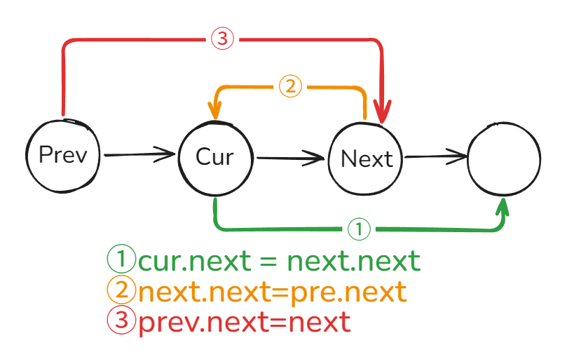

# (零)排序算法
## 冒泡排序
```java
public static void bubbleSort(int[] arr) {  
    for (int i = 0; i < arr.length - 1; i++) {  // 一共需要 arr.length - 1 趟，每一趟选出最大值放到数组末尾
        boolean swap = false;  // 假设当前趟没有元素交换
        for (int j = 0; j < arr.length - i - 1; j++) { // 从头开始遍历 
            if (arr[j] > arr[j + 1]) {  // j位置元素比j+1位置元素大，交换位置
                swap(arr, j, j + 1);  
                swap = true;  
            }  
        }  
        if (!swap) {  // 没有元素交换，元素已经有序，直接退出循环  
            break; 
        }  
    }  
}
```
## 选择排序
```java
public static void selectSort(int[] arr) {
	for (int i = 0; i < arr.length - 1; i++) {  // 一共需要 arr.length - 1 趟，每一趟选出最大值放到数组末尾
	    int minIndex = i;  // 假设最小元素的索引是i位置
	    for (int j = i + 1; j < arr.length; j++) {  // 遍历 i+1位置 到数组末尾，更新最小元素的索引值
	        if (arr[j] < arr[minIndex]) {  
	            minIndex = j;  
	        }  
	    }  
	    if (minIndex != i) {  // minIndex不是开始的位置，交换  
	        swap(arr, i, minIndex);  
	    }  
	}
}
```
## 插入排序
```java
public static void insertSort(int[] arr) {
	// arr[0] 天然有序
	for (int i = 1; i < arr.length; i++) { 
		// 每次从arr[0] ~ arr[i - 1] 进行排序，寻找arr[i]的插入位置
	    for (int j = i - 1; j >= 0 && arr[j] > arr[j + 1]; j--) {  
	        swap(arr, j, j + 1);  
	    }  
	}
}
```
## 快速排序
```java
public static void quickSort(int[] arr, int lo, int hi) {
	if (lo < hi) {
		int mid = lo + (hi - lo) / 2
		int pivot = arr[(int)(Math.random() * (hi - lo + 1)) + lo];
		// lt 是小于区的右边界， gt 是大于区的左边界，都是开区间不包含当前元素
		int lt = lo, more = hi, cur = lo;
		while (cur <= gt) {
			if (arr[cur] < pivot) {
				swap(arr, cur++, lt++);
			} else if (arr[cur] > pivot) {
				swap(arr, cur, gt--); 
			} else {
				cur++;
			} 
		}
		quickSort(arr, lo, lt - 1);
		quickSort(arr, gt + 1, hi);
	}
}
```
## 归并排序
```java
public static void mergeSort(int[] arr, int lo, int hi) {
	if (lo < hi) {
		int mid = lo + (hi - lo) / 2;
		mergeSort(arr, lo, mid); // 排序左边
		mergeSort(arr, mid + 1, hi); // 排序右边
		// 下面的部分是归并过程
		int[] help = new int[hi - lo + 1];
		int i = lo, j = mid + 1, k = 0;
		while (i <= mid && j <= hi) {
			if (arr[i] <= arr[j]) {
				help[k++] = arr[i++];
			} else {
				help[k++] = arr[j++];
			}
		}
		// 下面两个while只会走一个，主要是为了复制没遍历完的部分
		while (i <= mid) {
			help[k++] = arr[i++];
		}
		while (j <= hi) {
			help[k++] = arr[j++];
		}
		// k已经走到help末尾，需要重置k=0 
		k = 0;
		// 下面的过程就是将有序的 help 复制回原数组的 arr[lo] - arr[hi] 位置
		while (k < help.length) {
			arr[lo++] = help[k++];
		}
	}
}
```
## 堆排序
```java
public static void heapSort(int[] arr) {
	int len = arr.length;
	// 生成一个大根堆
	for (int i = 0; i < len; i++) {
		heapInsert(arr, i);
	}
	
	// 每次将大根堆的堆顶元素arr[0]放到arr[--len]位置
	// 然后 arr[0] - arr[len - 1]就不是大根堆，调整堆结构，使之重新成为大根堆
	// 直到 len = 1，说明已经排序完毕 
	while (len > 1) {
		swap(arr, 0, --len);
		heapify(arr, 0, len);
	}
}

private static void heapInsert(int[] arr, int idx) {
	// 此while循环会将一条路径中最大的元素往根节点上冒
	while (arr[idx] > arr[(idx - 1) / 2]) {
		swap(arr, idx, (idx - 1) / 2);
		idx = (idx - 1) / 2;
	}
}

private static void heapify(int[] arr, int idx, int size) {
	int l = idx * 2 + 1;
	while (l < size) {
		int best = l + 1 < size && arr[l + 1] > arr[l] ? l + 1 : l;
		best = arr[best] > arr[idx] ? best : idx; 
		if (best == idx) {
			break;
		}
		swap(arr, idx, best);
		idx = best;
		l = idx * 2 + 1;
	}
}
```
## 计数排序
```java
public static void countingSort(int[] arr) {  
    int max = arr[0];  
    for (int i : arr) {  
        if (i > max) {  
            max = i;  
        }  
    }  
  
    int bucketLen = max + 1;  
    // bucket[i] = i  
    int[] bucket = new int[bucketLen];  
  
    for (int value : arr) {  
        bucket[value]++; // bucket[value] = value 的数量+1  
    }  
  
    int cur = 0;  
    for (int j = 0; j < bucketLen; j++) {  
        while (bucket[j] > 0) {  
            arr[cur++] = j; // cur位置放置 j的值 cur++            
            bucket[j]--; // 桶内元素数量 - 1        
        }  
    }  
}
```
# (一)数组/字符串
## 88. 合并两个有序数组
给你两个按 **非递减顺序** 排列的整数数组 `nums1` 和 `nums2`，另有两个整数 `m` 和 `n` ，分别表示 `nums1` 和 `nums2` 中的元素数目。

请你 **合并** `nums2` 到 `nums1` 中，使合并后的数组同样按 **非递减顺序** 排列。
```java
public static void merge(int[] nums1, int m, int[] nums2, int n) {  
    int p1 = m - 1;
    int p2 = n - 1;
    int p = m + n - 1;
  
    while (p1 >= 0 && p2 >= 0) {
        if (nums1[p1] > nums2[p2]) {  
            nums1[p--] = nums1[p1--];  
        } else {  
            nums1[p--] = nums2[p2--];  
        }  
    }  
    while (p2 >= 0) {  
        nums1[p--] = nums2[p2--];  
    }  
}

```
## 27. 移除元素
给你一个数组 `nums` 和一个值 `val`，你需要 **原地** 移除所有数值等于 `val` 的元素。元素的顺序可能发生改变。然后返回 `nums` 中与 `val` 不同的元素的数量。

假设 `nums` 中不等于 `val` 的元素数量为 `k`，要通过此题，您需要执行以下操作：

- 更改 `nums` 数组，使 `nums` 的前 `k` 个元素包含不等于 `val` 的元素。`nums` 的其余元素和 `nums` 的大小并不重要。
- 返回 `k`。
```java
public int removeElement(int[] nums, int val) {  
    int left = -1; // 左边界：-1代表没有元素 0代表包含索引0的元素  
    for (int i = 0; i < nums.length; i++) {  
        if (nums[i] != val) {  
            nums[++left] = nums[i];  
        }  
    }  
    return left + 1;
}
```
## 26. 删除有序数组中的重复项
给你一个 **非严格递增排列** 的数组 `nums` ，请你 **原地** 删除重复出现的元素，使每个元素 **只出现一次** ，返回删除后数组的新长度。元素的 **相对顺序** 应该保持 **一致** 。然后返回 `nums` 中唯一元素的个数。

考虑 `nums` 的唯一元素的数量为 `k`。去重后，返回唯一元素的数量 `k`。

`nums` 的前 `k` 个元素应包含 **排序后** 的唯一数字。下标 `k - 1` 之后的剩余元素可以忽略。
```java
public int removeDuplicates(int[] nums) {  
    int left = 0; // 左边界  
    for (int i = 1; i < nums.length; i++) {  
        if (nums[i] != nums[left]) { //遍历的元素不等于左边界的值，加入到左边界内  
            nums[++left] = nums[i];  
        }  
    }  
    return left + 1; 
}
```

## 80. 删除有序数组中的重复项 II
给你一个有序数组 `nums` ，请你 **原地** 删除重复出现的元素，使得出现次数超过两次的元素**只出现两次** ，返回删除后数组的新长度。

不要使用额外的数组空间，你必须在 **原地** 修改输入数组 并在使用 O(1) 额外空间的条件下完成。
```java
public int removeDuplicates(int[] nums) {  
    int n = nums.length;  
    if (n == 1 || n == 2) {  
        return n;  
    }  
    int left = 1; // 左边界的值，  
    for (int i = 2; i < n; i++) {  
        //遍历的元素不等于左边界的前一个，这样可以保留两个重复的元素，加入到左边界内  
        if (nums[i] != nums[left - 1]) {  
            nums[++left] = nums[i];  
        }  
    }  
    return left + 1;  
}
```

## 169. 多数元素
给定一个大小为 `n` 的数组 `nums` ，返回其中的多数元素。多数元素是指在数组中出现次数 **大于** `⌊ n/2 ⌋` 的元素。

你可以假设数组是非空的，并且给定的数组总是存在多数元素。
```java
// 时间上打败了 99.85%
public int majorityElement(int[] nums) {  
    int candidate = nums[0];  
    int count = 0;  
    for (int num : nums) {  
        if (count == 0) candidate = num;  
        if (num == candidate) count++;  
        else count--;  
    }  
    return candidate;  
}

// 时间上打败了 100%
public int majorityElement(int[] nums) {
	quickSort(nums, 0, nums.length - 1);
	return nums[(nums.length - 1) / 2];
}

private void quickSort(int[] nums, int lo, int hi) {
	if (lo < hi) {
		int pivot = nums[lo];
		int lt = lo, gt = hi, cur = lo;
		while (cur <= gt) {
			if (nums[cur] < pivot) {
				swap(nums, cur++, lt++);
			} else if (nums[cur] > pivot) {
				swap(nums, gt, cur--);
			} else {
				cur++;
			}
		}
		quickSort(nums, lo, lt - 1);
		quickSort(nums, gt + 1, hi);
	}
}
```
## 189. 轮转数组
给定一个整数数组 `nums`，将数组中的元素向右轮转 `k` 个位置，其中 `k` 是非负数。

![[轮转数组.png]]

```java
public void rotate(int[] nums, int k) {
    int n = nums.length;
    k = k % n;
    reverseArray(nums, 0, n - 1);
    reverseArray(nums, 0, k - 1); 
    reverseArray(nums, k, n - 1); 
}  
  
private static void reverseArray(int[] nums, int left, int right) {  
    while (left < right) {  
        int temp = nums[left];  
        nums[left] = nums[right];  
        nums[right] = temp;  
        left++;  
        right--;  
    }  
}
```

## 121. 买卖股票的最佳时机 I
给定一个数组 `prices` ，它的第 `i` 个元素 `prices[i]` 表示一支给定股票第 `i` 天的价格。
你只能选择 **某一天** 买入这只股票，并选择在 **未来的某一个不同的日子** 卖出该股票。设计一个算法来计算你所能获取的最大利润。
返回你可以从这笔交易中获取的最大利润。如果你不能获取任何利润，返回 `0` 。

```java
public int maxProfit(int[] prices) {  
    // 核心思想：找到之前的最小数值，如果最小数值大于当前股票价格就不用更新利润，同时更新最低价格  
    int maxProfit = 0;  
    int cost = prices[0];  
    for (int i = 1; i < prices.length; i++) {  
        if (prices[i] > cost) {  
            maxProfit = Math.max(maxProfit, prices[i] - cost);  
        } else {  
            cost = prices[i];  
        }  
    }  
    return maxProfit;  
}
```
## 122. 买卖股票的最佳时机 II
给你一个整数数组 `prices` ，其中 `prices[i]` 表示某支股票第 `i` 天的价格。

在每一天，你可以决定是否购买和/或出售股票。你在任何时候 **最多** 只能持有 **一股** 股票。然而，你可以在 **同一天** 多次买卖该股票，但要确保你持有的股票不超过一股。

返回 _你能获得的 **最大** 利润_ 。

```java
public int maxProfit(int[] prices) {  
    int n = prices.length;  
    // buy表示买不买股票，sell表示卖不卖股票  
    int buy = -prices[0]; // 第一天买
    int sell = 0;         // 第一天卖
    for (int i = 1; i < n; i++) {  
        buy = Math.max(buy, sell - prices[i]);  
        sell = Math.max(sell, buy + prices[i]);  
    }  
    return sell;  
}
```
## 55. 跳跃游戏
给你一个非负整数数组 `nums` ，你最初位于数组的 **第一个下标** 。数组中的每个元素代表你在该位置可以跳跃的最大长度。
判断你是否能够到达最后一个下标，如果可以，返回 `true` ；否则，返回 `false` 。
```java
public boolean canJump(int[] nums) {  
    int k = 0; // 出发位置，也是能到达的最远位置  
    for (int i = 0; i < nums.length; i++) {  
        // 当前位置比能到达的最远位置还远，返回false  
        if (i > k) return false;  
        // 更新最远位置k  
        k = Math.max(k, i + nums[i]);  
    }  
    return true;  
}
```

## 45. 跳跃游戏 II
给定一个长度为 `n` 的 **0 索引**整数数组 `nums`。初始位置在下标 0。

每个元素 `nums[i]` 表示从索引 `i` 向后跳转的最大长度。换句话说，如果你在索引 `i` 处，你可以跳转到任意 `(i + j)` 处：
- `0 <= j <= nums[i]` 且 `i + j < n`

返回到达 `n - 1` 的最小跳跃次数。测试用例保证可以到达 `n - 1`。
```java
public int jump(int[] nums) {  
    int length = nums.length;  
    int end = 0;
    int maxPosition = 0;  
    int steps = 0;  
    // 判断能否到达数组末尾，所以不需要遍历到数组末尾，所以是i < length - 1  
    for (int i = 0; i < length - 1; i++) {  
        // 更新能到达的最远位置  
        maxPosition = Math.max(maxPosition, i + nums[i]);  
        // 如果当前位置已经到达最远位置，步数+1  
        if (i == end) {  
            end = maxPosition;  
            steps++;  
        }  
    }  
    return steps;  
}
```

## 274. H 指数
给你一个整数数组 `citations` ，其中 `citations[i]` 表示研究者的第 `i` 篇论文被引用的次数。计算并返回该研究者的 **`h` 指数**。

根据维基百科上 **h 指数**的定义 ：`h` 代表“高引用次数” ，一名科研人员的 `h` **指数** 是指他（她）至少发表了 `h` 篇论文，并且 **至少** 有 `h` 篇论文被引用次数大于等于 `h` 。如果 `h` 有多种可能的值，**`h` 指数** 是其中最大的那个。
```java
public int hIndex(int[] citations) {  
    int n = citations.length;  
    int[] count = new int[n + 1];  
    for (int citation : citations) {  
        if (citation >= n) {  
            count[n]++;  
        } else {  
            count[citation]++;  
        }  
    }  
    int res = 0;  
    for (int i = n; i >= 0; i--) {  
        res += count[i];  
        if (res >= i) {  
            return i;  
        }  
    }  
    return res;  
}
```
## 380. O(1) 时间插入、删除和获取随机元素
```java
class RandomizedSet {  
    // map记录记录数字和数组中的位置的映射，随机集合中的数字都是不重复的  
    private final HashMap<Integer, Integer> map;  
    private final List<Integer> list;  
    private final Random random;  
  
    //RandomizedSet() 初始化 RandomizedSet 对象  
    public RandomizedSet() {  
        list = new ArrayList<>();  
        map = new HashMap<>();  
        random = new Random();  
    }  
  
    //bool insert(int val) 当元素 val 不存在时，向集合中插入该项，并返回 true ；否则，返回 false 。  
    public boolean insert(int val) {  
        boolean contains = map.containsKey(val);  
        if (!contains) {  
            int index = list.size();  
            list.add(val);  
            map.put(val, index);  
            return true;        } else {  
            return false;  
        }  
    }  
  
    //bool remove(int val) 当元素 val 存在时，从集合中移除该项，并返回 true ；否则，返回 false 。  
    public boolean remove(int val) {  
        if (!map.containsKey(val)) {  
            return false;  
        }  
        int index = map.get(val);  
        // 删除一个元素需要把最后一个元素来顶替他的位置  
        int last = list.get(list.size() - 1);  
        list.set(index, last);  
        map.put(last, index);  
        list.remove(list.size() - 1);  
        map.remove(val);  
        return true;    }  
  
    //int getRandom() 随机返回现有集合中的一项（测试用例保证调用此方法时集合中至少存在一个元素）。每个元素应该有 相同的概率 被返回。  
    public int getRandom() {  
        int randomIndex = random.nextInt(list.size());  
        return list.get(randomIndex);  
    }  
}
```
## 238. 除自身以外数组的乘积

```java
public int[] productExceptSelf(int[] nums) {  
    int len = nums.length;  
  
    int[] res = new int[len];  
    res[0] = 1;  
    for (int i = 1; i < len; i++) {  
        res[i] = nums[i - 1] * res[i - 1];  
    }  
    int R = 1;  
    for (int i = res.length - 1; i >= 0; i--) {  
        res[i] = R * res[i];  
        R = R * nums[i];  
    }  
    return res;  
}
```

## 134. 加油站

```java
public int canCompleteCircuit(int[] gas, int[] cost) {  
    int n = gas.length;  
    int sum = 0;  
    // 窗口[l,r)  
    for (int l = 0, r = 0; l < n; l = r + 1, r = l) {  
        sum = 0;  
        while (sum + gas[r % n] - cost[r % n] >= 0) {  
            if (r - l + 1 == n) {  
                return l;  
            }  
            sum += gas[r % n] - cost[r % n];  
            r++;  
        }  
    }  
    return -1;  
}
```

## 135. 分发糖果

```java
public int candy(int[] ratings) {  
    int n = ratings.length;  
    int[] left = new int[n];  
    // 初始化left[] 如果右边比左边大，那么右边的设置成左边的+1，否则右边的就是1  
    for (int i = 0; i < n; i++) {  
        if (i > 0 && ratings[i] > ratings[i - 1]) {  
            left[i] = left[i - 1] + 1;  
        } else {  
            left[i] = 1;  
        }  
    }  
    int right = 0, ret = 0;  
    for (int i = n - 1; i >= 0; i--) {  
        // 倒序遍历，前面比后面大，前面+1，否则前面的为1  
        if (i < n - 1 && ratings[i] > ratings[i + 1]) {  
            right++;  
        } else {  
            right = 1;  
        }  
        ret += Math.max(left[i], right);  
    }  
    return ret;  
}
```

## 42. 接雨水

```java
public int trap(int[] height) {  
    int n = height.length;  
    int res = 0;  
    int l = 0, r = n - 1;  
    int leftMax = 0, rightMax = 0;  
    while (l < r) {  
        leftMax = Math.max(leftMax, height[l]);  
        rightMax = Math.max(rightMax, height[r]);  
        if (height[l] > height[r]) {  
            res += rightMax - height[r];  
            r--;  
        } else {  
            res += leftMax - height[l];  
            l++;  
        }  
    }  
    return res;  
}
```

## 13. 罗马数字转阿拉伯数字

```java
public int romanToInt(String s) {  
    Map<Character, Integer> symbolValues = new HashMap<Character, Integer>() {{  
        put('I', 1);  
        put('V', 5);  
        put('X', 10);  
        put('L', 50);  
        put('C', 100);  
        put('D', 500);  
        put('M', 1000);  
    }};  
    int ans = 0;  
    int n = s.length();  
    for (int i = 0; i < n; i++) {  
        int value = symbolValues.get(s.charAt(i));  
        // 当前值比下一个值要小，需要减去当前值  
        if (i < n - 1 && value < symbolValues.get(s.charAt(i + 1))) {  
            ans -= value;  
        } else {  
            ans += value;  
        }  
    }  
    return ans;  
}
```

## 12. 整数转罗马数字

```java
public String intToRoman(int num) {  
    return "";  
}
```

## 58. 最后一个单词的长度

```java
public int lengthOfLastWord(String s) {  
    String[] strings = s.split(" ");  
    return strings[strings.length - 1].length();  
}
```

## 14. 最长公共前缀

```java
public String longestCommonPrefix(String[] strs) {  
    int minLen = Integer.MAX_VALUE;  
    for (String str : strs) {  
        minLen = Math.min(minLen, str.length());  
    }  
    int res = 0;  
    StringBuilder builder = new StringBuilder();  
    outer:  
    for (int i = 0; i < minLen; i++) {  
        char c = strs[0].charAt(i);  
        for (int j = 1; j < strs.length; j++) {  
            if (c != strs[j].charAt(i)) {  
                break outer;  
            }  
        }  
        builder.append(c);  
    }  
    return builder.toString();  
}
```

## 151. 反转字符串中的单词

```java
public String reverseWords(String s) {  
    String[] words = s.trim().split(" ");  
    StringBuilder builder = new StringBuilder();  
    for (int i = words.length - 1; i > 0; i--) {  
        if (!words[i].isEmpty()) {  
            builder.append(words[i]).append(" ");  
        }  
    }  
    builder.append(words[0]);  
    return builder.toString();  
}
```

## 6. Z 字形变换

```java
public String convert(String s, int numRows) {  
    return "";  
}
```

## 28. 找出字符串中第一个匹配项的下标 KMP
```java
public int kmp(char[] s1, char[] s2) {
	int m = s1.length, n = s2.length;
	int x = 0, y = 0;
	int[] next = nextArray(s2, n);
	while(x < m && y < n) {
		if(s1[x] == s2[y]) { // 对应位置字符相等，都后移
			x++; 
			y++;
		} else if(y == 0) { 
			// 对应位置字符不相等，而且s2已经跳到头位置还不相等，
			// 表示之前的匹配全部都失效了，需要x往后移一位，重新开始匹配
			x++;
		} else { 
			// 对应位置字符不相等，但是s2还没有跳到头位置，前面还有有效匹配位置，从部分有效位置重新开始匹配
			y = next[y];
		}
	}
	// 跳出循环表示有谁到头了
	// 如果是y到头(此时y = n)，说明s1中有s2，最开始的位置就是 x - y
	// 否则是x到头(此时x = m），说明s1中没有s2，返回-1
	return y == n ? x - y : -1;
}

private static int[] nextArray(char[] s, int n) {  
    if (n == 1) {  
        return new int[] { -1 };  
    }  
    int[] next = new int[n];  
    next[0] = -1;  
    next[1] = 0;  
    // i表示当前要求next值的位置  
    // cn表示当前要和前一个字符比对的下标
    int i = 2, cn = 0;  
    while (i < n) {  
        if (s[i - 1] == s[cn]) {  
            next[i++] = ++cn;  
        } else if (cn > 0) {  
            cn = next[cn];
        } else {  
            next[i++] = 0;  
        }  
    }  
    return next;
}
```

## 68. 文本左右对齐

```java


```
# (二)双指针
## 125. 验证回文串
如果在将所有大写字符转换为小写字符、并移除所有非字母数字字符之后，短语正着读和反着读都一样。则可以认为该短语是一个 **回文串** 。

字母和数字都属于字母数字字符。

给你一个字符串 `s`，如果它是 **回文串** ，返回 `true` ；否则，返回 `false` 。

```java
public boolean isPalindrome(String s) {  
    int n = s.length();  
    s = s.toLowerCase();  
    int l = 0, r = n - 1;  
    while (l < r) {  
        while (l < r && isChar(s.charAt(l))) l++;  
        while (l < r && isChar(s.charAt(r))) r--;  
        if (l < r && s.charAt(l) != s.charAt(r)) return false;  
        l++;  
        r--;  
    }  
    return true;  
}

private boolean isChar(char c) {  
    return (c < 'a' || c > 'z') && (c < '0' || c > '9');  
}
```
## 392. 判断子序列
给定字符串 **s** 和 **t** ，判断 **s** 是否为 **t** 的子序列。

字符串的一个子序列是原始字符串删除一些（也可以不删除）字符而不改变剩余字符相对位置形成的新字符串。（例如，`"ace"`是`"abcde"`的一个子序列，而`"aec"`不是）。

**进阶：**

如果有大量输入的 S，称作 S1, S2, ... , Sk 其中 k >= 10亿，你需要依次检查它们是否为 T 的子序列。在这种情况下，你会怎样改变代码？

```java
public boolean isSubsequence(String s, String t) {  
    if (s.length() > t.length()) return false;  
    int sPtr = 0, tPtr = 0;  
    while (sPtr < s.length() && tPtr < t.length()) {  
        if (s.charAt(sPtr) == t.charAt(tPtr)) {  
            sPtr++;  
            tPtr++;  
        } else {  
            tPtr++;  
        }  
    }  
    return sPtr == s.length();  
}
```
## 167. 两数之和 II - 输入有序数组
给你一个下标从 **1** 开始的整数数组 `numbers` ，该数组已按 **非递减顺序排列**  ，请你从数组中找出满足相加之和等于目标数 `target` 的两个数。如果设这两个数分别是 `numbers[index1]` 和 `numbers[index2]` ，则 `1 <= index1 < index2 <= numbers.length` 。

以长度为 2 的整数数组 `[index1, index2]` 的形式返回这两个整数的下标 `index1` 和 `index2`。

你可以假设每个输入 **只对应唯一的答案** ，而且你 **不可以** 重复使用相同的元素。

你所设计的解决方案必须只使用常量级的额外空间。

```java
public int[] twoSum(int[] numbers, int target) {  
    int l = 0;  
    int r = numbers.length - 1;  
    while (l < r) {  
        if (numbers[l] + numbers[r] > target) {  
            r--;  
        } else if (numbers[l] + numbers[r] == target) {  
            return new int[]{l + 1, r + 1};  
        } else {  
            l++;  
        }  
    }  
    return null;  
}
```
## 11. 盛最多水的容器
给定一个长度为 `n` 的整数数组 `height` 。有 `n` 条垂线，第 `i` 条线的两个端点是 `(i, 0)` 和 `(i, height[i])` 。
找出其中的两条线，使得它们与 `x` 轴共同构成的容器可以容纳最多的水。
返回容器可以储存的最大水量。

```java
public int maxArea(int[] height) {  
    int max = 0;  
    int l = 0;  
    int r = height.length - 1;  
    while (l < r) {  
        int area = Math.min(height[l], height[r]) * (r - l);  
        max = Math.max(max, area);  
        if (height[l] < height[r]) {  
            l++;  
        } else {  
            r--;  
        }  
    }  
    return max;  
}
```
## 15. 三数之和
给你一个整数数组 `nums` ，判断是否存在三元组 `[nums[i], nums[j], nums[k]]` 满足 `i != j`、`i != k` 且 `j != k` ，同时还满足 `nums[i] + nums[j] + nums[k] == 0` 。请你返回所有和为 `0` 且不重复的三元组。

```java
public List<List<Integer>> threeSum_1(int[] nums) {  
    Arrays.sort(nums);
    int n = nums.length; 
    List<List<Integer>> ans = new ArrayList<>();  
    //     i         j         k
    //nums[i] + nums[j] + nums[k] = 0
    
    for (int i = 0; i < n - 2; i++) {  
        int x = nums[i];  
        if (i > 0 && x == nums[i - 1]) continue; // 跳过重复数字  
        if (x + nums[i + 1] + nums[i + 2] > 0) break; // 优化一  
        if (x + nums[n - 2] + nums[n - 1] < 0) continue; // 优化二  
        int j = i + 1;  
        int k = n - 1;  
        while (j < k) {  
            int s = x + nums[j] + nums[k];  
            if (s > 0) {  
                k--;  
            } else if (s < 0) {  
                j++;  
            } else { // 三数之和为 0                
	            List<Integer> list = new ArrayList<>();  
                list.add(x);  
                list.add(nums[j]);  
                list.add(nums[k]);  
                ans.add(list);  
                for (j++; j < k && nums[j] == nums[j - 1]; j++) ; // 跳过重复数字  
                for (k--; k > j && nums[k] == nums[k + 1]; k--) ; // 跳过重复数字  
            }  
        }  
    }  
    return ans;  
}  
  
public List<List<Integer>> threeSum_2(int[] nums) {  
    Arrays.sort(nums);  
    int n = nums.length;  
    List<List<Integer>> ans = new ArrayList<>(); 
     
    for (int i = 0; i < n; i++) {  
        if (nums[i] > 0) break;  
        if (i != 0 && nums[i] == nums[i - 1]) continue;  
        int left = i + 1;  
        int right = n - 1;  
        while (left < right) {  
            while (left < right && nums[left] + nums[right] < -nums[i]) {  
                left++;  
            }  
            while (left < right && nums[left] + nums[right] > -nums[i]) {  
                right--;  
            }  
            while (left < right && nums[left] + nums[right] == -nums[i]) {  
                List<Integer> list = new ArrayList<>();  
                list.add(nums[i]);  
                list.add(nums[left]);  
                list.add(nums[right]);  
                ans.add(list);  
                do left++; while (left < right && nums[left] == nums[left - 1]);  
                do right--; while (left < right && nums[right] == nums[right + 1]);  
            }  
        }  
    }
    return ans;  
}
```
## 283. 移动零
给定一个数组 `nums`，编写一个函数将所有 `0` 移动到数组的末尾，同时保持非零元素的相对顺序。

**请注意**，必须在不复制数组的情况下原地对数组进行操作
```java
public void moveZeroes(int[] nums) {  
    int l = -1, r = 0;  
    for (int i = 0; i < nums.length; i++) {  
        if (nums[i] != 0) {  
            swap(nums, ++l, i);  
        }  
    }  
}   
private void swap(int[] nums, int i, int j) {  
    int temp = nums[i];  
    nums[i] = nums[j];  
    nums[j] = temp;  
}
```
# (三)滑动窗口
## 209. 长度最小的子数组
```java
public int minSubArrayLen(int target, int[] nums) {  
    int ans = Integer.MAX_VALUE;  
    for (int l = 0, r = 0, sum = 0; r < nums.length; r++) {  
	    // 累加nums[r] 
        sum += nums[r];
        // 收缩窗口 
        while (sum >= target) {
		    // 更新最小数组长度
	        ans = Math.min(ans, r - l + 1);
	        // 收缩窗口，同时指针 l 右移
            sum -= nums[l++];  
        } 
    }  
    return ans == Integer.MAX_VALUE ? 0 : ans;  
}
```
## 3. 无重复字符的最长子串
```java
public int lengthOfLongestSubstring(String s) {  
    char[] chars = s.toCharArray();  
    // 字符都是ascii    char需要2字节，   2^16 - 1 = 255    
    int[] pos = new int[255]; 
    // 之前出现过的位置，默认-1：未在数组中出现过 
    Arrays.fill(pos, -1);  
    int ans = 0;  
    for (int l = 0, r = 0; r < chars.length; r++) { 
	    // 计算char[r]字符出现过的最远距离 
        l = Math.max(pos[chars[r]] + 1, l); 
        // 更新答案 
        ans = Math.max(ans, r - l + 1);  
        // 更新r的位置
        pos[chars[r]] = r;  
    }  
    return ans;  
}
```
## 30. 串联所有单词的子串
```java

```
## 76. 最小覆盖子串
```java
public String minWindow(String s, String t) {  
    char[] sArr = s.toCharArray();  
    char[] tArr = t.toCharArray();  
    int[] arr = new int[256];  
    // arr表示欠债表  
    for (char c : tArr) {  
        arr[c]--;  
    }  
    // 欠的字母的数量  
    int debt = t.length();  
    int start = 0;  
    int len = Integer.MAX_VALUE;  
    for (int l = 0, r = 0; r < s.length(); r++) {  
        // 当前字母是欠的字母，并且没还完  
        if (arr[sArr[r]]++ < 0) {  
            debt--; // 还款加1  
        }  
        // 还完了。开始收缩  
        if (debt == 0) {  
            // 当前位置数量大于0，可以减去，l++;更新arr  
            while (arr[sArr[l]] > 0) {  
                arr[sArr[l++]]--;  
            }  
            // 找到了更小的长度，更新最小长度len，和开始位置start  
            if (r - l + 1 < len) {  
                len = r - l + 1;  
                start = l;  
            }  
        }  
    }  
    return len == Integer.MAX_VALUE ? "" : s.substring(start, start + len);  
}
```
# (四)矩阵

## 36. 有效的数独
```java
public boolean isValidSudoku(char[][] board) {  
    int[][] column = new int[9][9];  
    int[][] row = new int[9][9];  
    int[][][] sub = new int[3][3][9];  
    for (int i = 0; i < 9; i++) {  
        for (int j = 0; j < 9; j++) {  
            char c = board[i][j];  
            if (c != '.') {  
                int index = c - '1';  
                row[i][index]++;  
                column[j][index]++;  
                sub[i / 3][j / 3][index]++;  
                if (row[i][index] > 1 || column[j][index] > 1 || sub[i / 3][j / 3][index] > 1) {  
                    return false;  
                }  
            }  
        }  
    }  
    return true;  
}
```

## 54. 螺旋矩阵
```java
public List<Integer> spiralOrder(int[][] matrix) {  
    List<Integer> list = new ArrayList<>();  
    int m = matrix.length; // 行数  
    int n = matrix[0].length; // 列数  
    int left = 0, right = n - 1, top = 0, bottom = m - 1;  
    while (left <= right && top <= bottom) {  
        if (left <= right && top <= bottom) {  
            for (int i = left; i <= right; i++) {  
                list.add(matrix[top][i]);  
            }  
            top++;  
        }  
        if (left <= right && top <= bottom) {  
            for (int i = top; i <= bottom; i++) {  
                list.add(matrix[i][right]);  
            }  
            right--;  
        }  
        if (left <= right && top <= bottom) {  
            for (int i = right; i >= left; i--) {  
                list.add(matrix[bottom][i]);  
            }  
            bottom--;  
        }  
        if (left <= right && top <= bottom) {  
            for (int i = bottom; i >= top; i--) {  
                list.add(matrix[i][left]);  
            }  
            left++;  
        }  
  
    }  
    return list;  
}
```
## 48. 旋转图像
```java
public void rotate(int[][] matrix) {  
    int m = matrix.length;  
    int n = matrix[0].length;  
    for (int i = 0; i < m / 2; i++) {  
        for (int j = 0; j < n; j++) {  
            int temp = matrix[i][j];  
            matrix[i][j] = matrix[m - 1 - i][j];  
            matrix[m - 1 - i][j] = temp;  
        }  
    }  
    // 主对角翻转  
    for (int i = 0; i < m; i++) {  
        for (int j = i; j < n; j++) {  
            int temp = matrix[i][j];  
            matrix[i][j] = matrix[j][i];  
            matrix[j][i] = temp;  
        }  
    }  
}
```
## 73. 矩阵置零
```java
public void setZeroes(int[][] matrix) {  
    int m = matrix.length, n = matrix[0].length;  
    boolean[] row = new boolean[m];  
    boolean[] col = new boolean[n];  
    for (int i = 0; i < m; i++) {  
        for (int j = 0; j < n; j++) {  
            if (matrix[i][j] == 0) {  
                row[i] = col[j] = true;  
            }  
        }  
    }  
    for (int i = 0; i < m; i++) {  
        for (int j = 0; j < n; j++) {  
            if (row[i] || col[j]) {  
                matrix[i][j] = 0;  
            }  
        }  
    }  
}
```
## 289. 生命游戏
```java
public void gameOfLife(int[][] board) {  
    int m = board.length;  
    int n = board[0].length;  
    int[][] tmp = new int[m][n];  
    for (int i = 0; i < m; i++) {  
        for (int j = 0; j < n; j++) {  
            int live = 0;  
            // 判断该细胞周围八个位置的情况  
            for (int k = i - 1; k <= i + 1; k++) {  
                for (int l = j - 1; l <= j + 1; l++) {  
                    if (k < 0 || k >= m || l < 0 || l >= n || (k == i && l == j)) {  
                        continue;  
                    }  
                    if (board[k][l] == 1) {  
                        live++;  
                    }  
                }  
            }  
            if (board[i][j] == 1) {  
                // 如果活细胞周围八个位置有超过三个活细胞，则该位置活细胞死亡；  
                // 如果活细胞周围八个位置的活细胞数少于两个，则该位置活细胞死亡；  
                if (live < 2 || live > 3) {  
                    tmp[i][j] = 0;  
                } else {  
                    // 如果活细胞周围八个位置有两个或三个活细胞，则该位置活细胞仍然存活；  
                    tmp[i][j] = 1;  
                }  
            } else {  
                // 如果死细胞周围正好有三个活细胞，则该位置死细胞复活；  
                if (live == 3) tmp[i][j] = 1;  
            }  
        }  
    }  
    // 更新表格  
    for (int i = 0; i < m; i++) {  
        System.arraycopy(tmp[i], 0, board[i], 0, n);  
    }  
}
```
# (五)哈希

## 383. 赎金信
给你两个字符串：`ransomNote` 和 `magazine` ，判断 `ransomNote` 能不能由 `magazine` 里面的字符构成。

如果可以，返回 `true` ；否则返回 `false` 。

`magazine` 中的每个字符只能在 `ransomNote` 中使用一次。

```java
public boolean canConstruct(String ransomNote, String magazine) { 
	// 26个字母的哈希表 
    int[] hash = new int[26]; 
    // 统计每个字母出现的次数 
    for (int i = 0; i < magazine.length(); i++) {  
        char c = magazine.charAt(i);  
        hash[c - 'a']++;  
    } 
    // 检查 ransomNote中字母出现的次数是否符合hash要求
    for (int i = 0; i < ransomNote.length(); i++) {  
        char c = ransomNote.charAt(i);
        // 如果hash中这个字符已经为0，但是遍历到了新的c，说明ransomNote中这个字符比magazine多
        if (hash[c - 'a'] == 0) {
	        return false;
        } else {
	        // 不为0，才可以减，做到了边遍历便检查
	        hash[c - 'a']--;  
        }
    }  
    return true;  
}
```

## 205. 同构字符串
给定两个字符串 `s` 和 `t` ，判断它们是否是同构的。

如果 `s` 中的字符可以按某种映射关系替换得到 `t` ，那么这两个字符串是同构的。

每个出现的字符都应当映射到另一个字符，同时不改变字符的顺序。不同字符不能映射到同一个字符上，相同字符只能映射到同一个字符上，字符可以映射到自己本身。

```java
public boolean isIsomorphic(String s, String t) {  
    HashMap<Character, Character> s2t = new HashMap<>(); 
    HashMap<Character, Character> t2s = new HashMap<>(); 
    for (int i = 0; i < s.length(); i++) {  
        char x = s.charAt(i);  
        char y = t.charAt(i);
        if ((s2t.containsKey(x) && s2t.get(x) != y) || 
	        (t2s.containsKey(y) && t2s.get(t) != x)) {
	        return false;
        }
        s2t.put(x, y);
        t2s.put(y, x);
    }  
    return true;  
}
```
## 290. 单词规律(同205. 同构字符串)
给定一种规律 `pattern` 和一个字符串 `s` ，判断 `s` 是否遵循相同的规律。

这里的 **遵循** 指完全匹配，例如， `pattern` 里的每个字母和字符串 `s` 中的每个非空单词之间存在着双向连接的对应规律。具体来说：

- `pattern` 中的每个字母都 **恰好** 映射到 `s` 中的一个唯一单词。
- `s` 中的每个唯一单词都 **恰好** 映射到 `pattern` 中的一个字母。
- 没有两个字母映射到同一个单词，也没有两个单词映射到同一个字母。

```java
public boolean wordPattern(String pattern, String s) {  
    HashMap<Character, String> map = new HashMap<>();  
    int len = pattern.length();  
    String[] str = s.split(" ");  
    if (len != str.length) return false;  
    for (int i = 0; i < len; i++) {  
        char key = pattern.charAt(i);  
        if (!map.containsKey(key)) {  
            if (map.containsValue(str[i])) {  
                return false;  
            }  
            map.put(key, str[i]);  
        } else if (!map.get(key).equals(str[i])) {  
            return false;  
        }  
    }  
    return true;  
}
```
## 242. 有效的字母异位词
给定两个字符串 `s` 和 `t` ，编写一个函数来判断 `t` 是否是 `s` 的 字母异位词。

```java
public boolean isAnagram(String s, String t) {  
    Map<Character, Integer> map = new HashMap<>();  
    if (s.length() != t.length()) return false;  
    for (int i = 0; i < s.length(); i++) {  
        map.put(s.charAt(i), map.getOrDefault(s.charAt(i), 0) + 1);  
    } 
    
    for (int i = 0; i < t.length(); i++) {  
        char c = t.charAt(i);  
        if (!map.containsKey(c)) {  
            return false;  
        }  
        Integer count = map.get(c);  
        if (count > 0) {  
            map.put(c, --count);  
        } else {  
            return false;  
        }  
    }  
    return true;  
}
```
## 49. 字母异位词分组
```java
public List<List<String>> groupAnagrams(String[] strs) {  
    Map<String, List<String>> map = new HashMap<>();  
    for (String s : strs) {  
        char[] charArray = s.toCharArray();  
        Arrays.sort(charArray);  
        String key = new String(charArray);  
        List<String> strings = map.getOrDefault(key, new ArrayList<>());  
        strings.add(s);  
        map.put(key, strings);  
    }  
    return new ArrayList<>(map.values());  
}
```
## 1. 两数之和
给定一个整数数组 `nums` 和一个整数目标值 `target`，请你在该数组中找出 **和为目标值** _`target`_  的那 **两个** 整数，并返回它们的数组下标。

你可以假设每种输入只会对应一个答案，并且你不能使用两次相同的元素。

你可以按任意顺序返回答案。

```java
public int[] twoSum(int[] nums, int target) {  
    Map<Integer, Integer> map = new HashMap<>();  
    for (int i = 0; i < nums.length; i++) {  
        int num = nums[i];  
        if (map.containsKey(target - num)) {  
            return new int[]{map.get(target - num), i};  
        }  
        map.put(num, i);  
    }  
    return null;  
}
```
## 202. 快乐数
编写一个算法来判断一个数 `n` 是不是快乐数。

**「快乐数」** 定义为：

- 对于一个正整数，每一次将该数替换为它每个位置上的数字的平方和。
- 然后重复这个过程直到这个数变为 1，也可能是 **无限循环** 但始终变不到 1。
- 如果这个过程 **结果为** 1，那么这个数就是快乐数。

如果 `n` 是 _快乐数_ 就返回 `true` ；不是，则返回 `false` 。

```java
public boolean isHappy(int n) {  
    int slow = n;  
    int fast = newN(n); // 快指针先走一步
    // 退出循环条件 
    // 1. fast指针为1, 没遇到慢指针也直接退出, 不用再迭代
    // 2. fast指针不为1, 没遇到慢指针, 继续迭代
    while (fast != 1 && slow != fast) {  
        slow = newN(slow);  // 慢指针走一步 
        fast = newN(newN(fast));  // 快指针走两步
    }
    // 快指针可能存在不等于1的情况, 比如快慢指针相遇, 结果趋于稳定,但都不为 1
    return fast == 1;  
}  
  
private int newN(int n) {  
    int sum = 0;  
    while (n > 0) {  
        int digit = n % 10;  
        sum += digit * digit;  
        n /= 10;  
    }  
    return sum;  
}
```
## 219. 存在重复元素 II
给你一个整数数组 `nums` 和一个整数 `k` ，判断数组中是否存在两个 **不同的索引** `i` 和 `j` ，满足 `nums[i] == nums[j]` 且 `abs(i - j) <= k` 。如果存在，返回 `true` ；否则，返回 `false` 。

```java
public boolean containsNearbyDuplicate(int[] nums, int k) {  
    HashMap<Integer, Integer> map = new HashMap<>();  
    for (int i = 0; i < nums.length; i++) {  
        int num = nums[i];  
        if (map.containsKey(num)) {  
            Integer index = map.get(num);  
            if (Math.abs(i - index) <= k) {  
                return true;  
            }  
        }
        map.put(num, i);  
    }  
    return false;  
}
```
## 128. 最长连续序列
给定一个未排序的整数数组 `nums` ，找出数字连续的最长序列（不要求序列元素在原数组中连续）的长度。

请你设计并实现时间复杂度为 `O(n)` 的算法解决此问题。

```java
public int longestConsecutive(int[] nums) {  
	if (nums.length <= 1) return nums.length;   
	// 找最值
	int min = nums[0], max = nums[0];
	for (int num : nums) {
		if (num < min) min = num;
		if (num > max) max = num;
	}
	// 特殊情况
	if (min == max) return 1;
	long range = (long) max - min + 1;
	// 范围太大用 HashSet
	if (range > nums.length * 2L) {
		Set<Integer> set = new HashSet<>();
		for (int num : nums) set.add(num);
		
		int maxLen = 0;
		for (int num : set) {
			if (!set.contains(num - 1)) {
				int len = 0;
				while (set.contains(num++)) len++;
				maxLen = Math.max(maxLen, len);
			}
		}
		return maxLen;
	} else {
		// 使用 boolean 数组
		boolean[] exists = new boolean[(int) range];
		for (int num : nums) {
			exists[num - min] = true;
		}
		int maxLen = 1, currentLen = 0;
		for (boolean exist : exists) {
			if (exist) {
				if (++currentLen > maxLen) maxLen = currentLen;
			} else {
				currentLen = 0;
			}
		}
		return maxLen; 
	}
}
```
# (六)区间
## 228. 汇总区间
给定一个  **无重复元素** 的 **有序** 整数数组 `nums` 。

区间 `[a,b]` 是从 `a` 到 `b`（包含）的所有整数的集合。

返回 _**恰好覆盖数组中所有数字** 的 **最小有序** 区间范围列表_ 。也就是说，`nums` 的每个元素都恰好被某个区间范围所覆盖，并且不存在属于某个区间但不属于 `nums` 的数字 `x` 。

列表中的每个区间范围 `[a,b]` 应该按如下格式输出：

- `"a->b"` ，如果 `a != b`
- `"a"` ，如果 `a == b`

```java
public static List<String> summaryRanges(int[] nums) {  
    List<String> res = new ArrayList<>();  
    int n = nums.length;  
    int left = 0, right = 0;  
    while (right < n) {  
        // 下一个没有越界且下一个数比当前大1，可以往后遍历  
        while (right + 1 < n && nums[right] + 1 == nums[right + 1]) {  
            right++;  
        }  
        // 如果只有一个数组  
        if (left == right) {  
            res.add("" + nums[left]);  
        } else {  
            // 当前区间有多个数  
            res.add(nums[left] + "->" + nums[right]);  
        }  
        // 下标在left~right的区间处理完毕，更新left，right  
        left = right + 1;  
        right++;  
    }  
    return res;  
}
```
## 56. 合并区间
以数组 `intervals` 表示若干个区间的集合，其中单个区间为 $intervals[{i}] = [start_{i},end_{i}]$。请你合并所有重叠的区间，并返回 _一个不重叠的区间数组，该数组需恰好覆盖输入中的所有区间_ 。
```java
public int[][] merge(int[][] intervals) {  
    if (intervals.length == 0) return new int[0][2];  
    int n = intervals.length;  
    // 按照区间起始位置从小到大排序  
    Arrays.sort(intervals, Comparator.comparingInt(o -> o[0]));  
    List<int[]> res = new ArrayList<>();  
    // 初始情况：最小就是第一个开头，最大就是第一个末尾  
    int min = intervals[0][0], max = intervals[0][1];  
    // 遍历剩下的区间  
    for (int i = 1; i < n; i++) {  
        // 当前区间起始位置大于之前的最大值，说明前面的区间和后面的区间是断开的，可以收集前一个区间。  
        // 更新最小值：当前区间的起始位置，  
        // 更新最大值：当前区间的结束位置  
        if (intervals[i][0] > max) {  
            res.add(new int[]{min, max});  
            min = intervals[i][0];  
            max = intervals[i][1];  
        } else {  
            // 可以合并，更新区间的最大值最小值  
            min = Math.min(min, intervals[i][0]);  
            max = Math.max(max, intervals[i][1]);  
        }  
    }  
    // 添加最后一个  
    res.add(new int[]{min, max});  
    // 转化为数组返回  
    return res.toArray(new int[res.size()][]);  
}
```
## 57. 插入区间
```java
public int[][] insert(int[][] intervals, int[] newInterval) {  
    int left = newInterval[0];  
    int right = newInterval[1];  
    boolean placed = false;  
    List<int[]> ansList = new ArrayList<>();  
    for (int[] interval : intervals) {  
  
        if (interval[0] > right) {  
            // 在插入区间的右侧且无交集  
            if (!placed) {  
                // 如果没有添加过newInterval，就添加，同时更新placed  
                ansList.add(new int[]{left, right});  
                placed = true;  
            }  
            ansList.add(interval);  
        } else if (interval[1] < left) {  
            // 在插入区间的左侧且无交集  
            ansList.add(interval);  
        } else {  
            // 与插入区间有交集，计算它们的并集  
            left = Math.min(left, interval[0]);  
            right = Math.max(right, interval[1]);  
        }  
    }  
    if (!placed) {  
        ansList.add(new int[]{left, right});  
    }  
    int[][] ans = new int[ansList.size()][2];  
    for (int i = 0; i < ansList.size(); ++i) {  
        ans[i] = ansList.get(i);  
    }  
    return ans;  
}
```
## 452. 用最少数量的箭引爆气球
```java
public int findMinArrowShots(int[][] points) {  
    // 右端点从小到大排序  
    Arrays.sort(points, Comparator.comparingInt(o -> o[1]));  
    long pre = Long.MIN_VALUE;  
    int cnt = 0;  
    for (int[] point : points) {  
        if (point[0] > pre) {  
            pre = point[1];  
            cnt++;  
        }  
    }  
    return cnt;  
}
```
# (七)栈
## 20. 有效的括号
```java
public boolean isValid(String s) {  
    int n = s.length();  
    if (n % 2 == 1) {  
        return false;  
    }  
    Map<Character, Character> map = new HashMap<>();  
    map.put(')', '(');  
    map.put(']', '[');  
    map.put('}', '{');  
    Stack<Character> stack = new Stack<Character>();  
    for (int i = 0; i < s.length(); i++) {  
        char ch = s.charAt(i);  
        if (map.containsKey(ch)) {  
            if (stack.isEmpty() || stack.peek() != map.get(ch)) {  
                return false;  
            }  
            stack.pop();  
        } else {  
            stack.push(ch);  
        }  
    }  
    return stack.isEmpty();  
}
```
## 71. 简化路径
```java
public String simplifyPath(String path) {  
    String[] names = path.split("/");  
    Deque<String> queue = new ArrayDeque<>();  
    for (String name : names) {  
        if ("..".equals(name)) {  
            if (!queue.isEmpty()) {  
                queue.pollLast();  
            }  
        } else if (!name.isEmpty() && !".".equals(name)) {  
            queue.offerLast(name);  
        }  
    }  
    StringBuilder ans = new StringBuilder();  
    if (queue.isEmpty()) {  
        ans.append("/");  
    } else {  
        while (!queue.isEmpty()) {  
            ans.append('/');  
            ans.append(queue.pollFirst());  
        }  
    }  
    return ans.toString();  
}
```
## 155. 最小栈
```java
class MinStack {  
  
    private final Stack<Integer> minValStack;  
    private final Stack<Integer> storeStack;  
  
    public MinStack() {  
        minValStack = new Stack<>();  
        storeStack = new Stack<>();  
        minValStack.push(Integer.MAX_VALUE);  
    }  
  
    public void push(int val) {  
        minValStack.push(Math.min(minValStack.peek(), val));  
        storeStack.push(val);  
    }  
  
    public void pop() {  
        storeStack.pop();  
        minValStack.pop();  
    }  
  
    public int top() {  
        return storeStack.peek();  
    }  
  
    public int getMin() {  
        return minValStack.peek();  
    }  
}
```
## 150. 逆波兰表达式求值
```java
public int evalRPN(String[] tokens) {  
    Stack<Integer> valStack = new Stack<>();  
    for (String token : tokens) {  
        if (isNumber(token)) {  
            valStack.push(Integer.parseInt(token));  
        } else {  
            int num2 = valStack.pop();  
            int num1 = valStack.pop();  
            switch (token) {  
                case "+":  
                    valStack.push(num1 + num2);  
                    break;                case "-":  
                    valStack.push(num1 - num2);  
                    break;                case "*":  
                    valStack.push(num1 * num2);  
                    break;                case "/":  
                    valStack.push(num1 / num2);  
                    break;                default:  
            }  
        }  
    }  
    return valStack.pop();  
}

public boolean isNumber(String token) {  
    return !("+".equals(token) || "-".equals(token) || "*".equals(token) || "/".equals(token));  
}

```
## 224. 基本计算器
```java

```
# (八)链表
## 141. 环形链表
给你一个链表的头节点 `head` ，判断链表中是否有环。

如果链表中有某个节点，可以通过连续跟踪 `next` 指针再次到达，则链表中存在环。 为了表示给定链表中的环，评测系统内部使用整数 `pos` 来表示链表尾连接到链表中的位置（索引从 0 开始）。**注意：`pos` 不作为参数进行传递** 。仅仅是为了标识链表的实际情况。

_如果链表中存在环_ ，则返回 `true` 。 否则，返回 `false` 。
```java
public boolean hasCycle(ListNode head) {  
    if (head == null) return false;  
    ListNode fast = head;  
    ListNode slow = head;  
    while (fast.next != null && fast.next.next != null) {  
        fast = fast.next.next;  
        slow = slow.next;  
        if (fast == slow) {  
            return true;  
        }  
    }  
    return false;  
}
```
## 2. 两数相加
给你两个 **非空** 的链表，表示两个非负的整数。它们每位数字都是按照 **逆序** 的方式存储的，并且每个节点只能存储 **一位** 数字。

请你将两个数相加，并以相同形式返回一个表示和的链表。

你可以假设除了数字 0 之外，这两个数都不会以 0 开头。
```java
public ListNode addTwoNumbers(ListNode l1, ListNode l2) {  
    ListNode dummy = new ListNode(-1);  
    ListNode iter = dummy;  
    int carry = 0;  
    int x = 0;  
    int y = 0;  
    int sum = 0;  
    while (l1 != null || l2 != null) {  
        x = l1 == null ? 0 : l1.val;  
        y = l2 == null ? 0 : l2.val;  
        sum = carry + x + y;  
        carry = sum / 10;  
        iter.next = new ListNode(sum % 10);  
        iter = iter.next;  
        if (l1 != null) l1 = l1.next;  
        if (l2 != null) l2 = l2.next;  
    }  
    if (carry > 0) {  
        iter.next = new ListNode(carry);  
    }  
    return dummy.next;  
}
```
## 21. 合并两个有序链表
将两个升序链表合并为一个新的 **升序** 链表并返回。新链表是通过拼接给定的两个链表的所有节点组成的。
```java
public ListNode mergeTwoLists_NoSentinel(ListNode list1, ListNode list2) {  
    if (list1 == null || list2 == null) return list1 == null ? list2 : list1;  
    ListNode head = list1.val < list2.val ? list1 : list2;  
    ListNode c1 = head.next;  
    ListNode c2 = head == list1 ? list2 : list1;  
    ListNode pre = head;  
    while (c1 != null && c2 != null) {  
        if (c1.val <= c2.val) {  
            pre.next = c1;  
            c1 = c1.next;  
        } else {  
            pre.next = c2;  
            c2 = c2.next;  
        }  
        pre = pre.next;  
    }  
    pre.next = c1 == null ? c2 : c1;  
    return head;  
}
```
## 138. 随机链表的复制
给你一个长度为 `n` 的链表，每个节点包含一个额外增加的随机指针 `random` ，该指针可以指向链表中的任何节点或空节点。

构造这个链表的 **[深拷贝](https://baike.baidu.com/item/%E6%B7%B1%E6%8B%B7%E8%B4%9D/22785317?fr=aladdin)**。 深拷贝应该正好由 `n` 个 **全新** 节点组成，其中每个新节点的值都设为其对应的原节点的值。新节点的 `next` 指针和 `random` 指针也都应指向复制链表中的新节点，并使原链表和复制链表中的这些指针能够表示相同的链表状态。**复制链表中的指针都不应指向原链表中的节点** 。

例如，如果原链表中有 `X` 和 `Y` 两个节点，其中 `X.random --> Y` 。那么在复制链表中对应的两个节点 `x` 和 `y` ，同样有 `x.random --> y` 。

返回复制链表的头节点。

用一个由 `n` 个节点组成的链表来表示输入/输出中的链表。每个节点用一个 `[val, random_index]` 表示：

- `val`：一个表示 `Node.val` 的整数。
- `random_index`：随机指针指向的节点索引（范围从 `0` 到 `n-1`）；如果不指向任何节点，则为  `null` 。

你的代码 **只** 接受原链表的头节点 `head` 作为传入参数。
```java
class Node {
    int val;
    Node next;
    Node random;

    public Node(int val) {
        this.val = val;
        this.next = null;
        this.random = null;
    }
}

public Node copyRandomList(Node head) {  
    if (head == null) return null;  
    Map<Node, Node> map = new HashMap<>();  
    Node cur = head;  
    while (cur != null) {  
        map.put(cur, new Node(cur.val));  
        cur = cur.next;  
    }  
    cur = head;  
    while (cur != null) {  
        Node node = map.get(cur);  
        node.next = map.get(cur.next);  
        node.random = map.get(cur.random);  
        cur = cur.next;  
    }  
    return map.get(head);  
}
```
## 92. 反转链表 II
给你单链表的头指针 `head` 和两个整数 `left` 和 `right` ，其中 `left <= right` 。请你反转从位置 `left` 到位置 `right` 的链表节点，返回 **反转后的链表** 。



```java
public ListNode reverseBetween(ListNode head, int left, int right) {  
    ListNode dummy = new ListNode(-1, head);  
    ListNode pre = dummy;  
    // 走到需要反转的前一个节点  
    for (int i = 0; i < left - 1; i++) {  
        pre = pre.next;  
    }  
    // cur指向需要反转的第一个节点  
    ListNode cur = pre.next;  
    ListNode next;  
    // 头插法  
    for (int i = left; i < right; i++) {  
        next = cur.next;
		cur.next = next.next;
		next.next = pre.next;
		pre.next = next;
    }  
    return dummy.next;  
}
```
## 25. K个一组反转链表
给你链表的头节点 `head` ，每 `k` 个节点一组进行翻转，请你返回修改后的链表。

`k` 是一个正整数，它的值小于或等于链表的长度。如果节点总数不是 `k` 的整数倍，那么请将最后剩余的节点保持原有顺序。

你不能只是单纯的改变节点内部的值，而是需要实际进行节点交换。
```java
public ListNode reverseKGroup(ListNode head, int k) {  
    ListNode dummy = new ListNode(0, head);  
    ListNode prev = dummy; 
    ListNode cur = head;
    ListNode next;  
    int length = 0;  
    // 求出链表长度  
    while (cur != null) {  
        cur = cur.next;  
        length++;  
    }  
    // 遍历指针cur重新指向head  
    cur = head;  
    // length/k 总共执行length/k次  
    for (int i = 1; i <= length / k; i++) {  
        // 具体的链表反转逻辑  
        for (int j = 1; j < k; j++) {  
            next = cur.next;  
            cur.next = next.next;  
            next.next = prev.next;  
            prev.next = next;  
        }  
        // 翻转完一组更新prev和cur  
        prev = cur;  
        cur = cur.next;  
    }  
    return dummy.next;  
}
```
## 19. 删除链表的倒数第N个节点
给你一个链表，删除链表的倒数第 `n` 个结点，并且返回链表的头结点。
```java
public ListNode removeNthFromEnd(ListNode head, int n) {  
    ListNode dummy = new ListNode(0, head);  
    ListNode slow = dummy;  
    ListNode fast = dummy;  
    int k = n;
    // 快指针先跑  
    while (k > 0) {  
        fast = fast.next;  
        k--;  
    } 
    // 快慢指针一起跑，快指针跑到末尾时，慢指针正好位于要删除节点的前一个节点
    // 为什么 fast.next!=null?
    // 因为我们利用了虚拟节点dummy，从dummy开始遍历，就是为了停到要删除结点的前一个，所以走到最后一个节点就行了 
    while (fast.next != null) {  
        fast = fast.next;  
        slow = slow.next;  
    }  
    slow.next = slow.next.next;  
    return dummy.next;  
}
```
## 82. 删除排序链表中的重复元素 II
给定一个已排序的链表的头 `head` ， _删除原始链表中所有重复数字的节点，只留下不同的数字_ 。返回 _已排序的链表_ 。
```java
public ListNode deleteDuplicates(ListNode head) {  
    if (head == null) return null;  
    ListNode dummy = new ListNode(0, head);  
    ListNode cur = dummy;  
    
    while (cur.next != null && cur.next.next != null) {  
        if (cur.next.val == cur.next.next.val) {  
            int x = cur.next.val;  
            while (cur.next != null && cur.next.val == x) {  
                cur.next = cur.next.next; // 删除  
            }  
        } else {  
            cur = cur.next;  
        }  
    }  
    return dummy.next;  
}

// 对比 83. 删除排序链表中的重复元素

// 给定一个已排序的链表的头 head ， 删除所有重复的元素，使每个元素只出现一次 。返回 已排序的链表 。
public ListNode deleteDuplicates(ListNode head) {
	ListNode dummy = new ListNode(-1, head);
	int preVal;
	ListNode cur = dummy;
	while (cur.next != null && cur.next.next != null) {
		if (cur.next.val == cur.next.next.val) {
			cur.next = cur.next.next;
	    } else {
			cur = cur.next;
		}
	}
	return dummy.next;
}
```
## 61. 旋转链表
给你一个链表的头节点 `head` ，旋转链表，将链表每个节点向右移动 `k` 个位置。
```java
public ListNode rotateRight(ListNode head, int k) {  
    if (head == null || head.next == null || k == 0) return head;  
    int length = 0; 
    // 求总长度 
    ListNode cur = head;  
    while (cur != null) {  
        length++;  
        cur = cur.next;  
    }  
	// 有些 k 会很大
    k = k % length;
    if (k == 0) return head;  
    int i = length - k;  
	  
    cur = head;
    // 为了走到要旋转的节点的前面 必须是--i  
    while (--i > 0) {  
        cur = cur.next;  
    }  
    ListNode newHead = cur.next;  
    // 断开两部分
    cur.next = null; 
    // 走到新的头节点的末尾 
    ListNode tmp = newHead;  
    while (tmp.next != null) {  
        tmp = tmp.next;  
    }  
    tmp.next = head;  
    return newHead;  
}
```
## 86. 分隔链表
给你一个链表的头节点 `head` 和一个特定值 `x` ，请你对链表进行分隔，使得所有 **小于** `x` 的节点都出现在 **大于或等于** `x` 的节点之前。

你应当 **保留** 两个分区中每个节点的初始相对位置。
```java
public ListNode partition(ListNode head, int x) {  
    ListNode dummy = new ListNode(0, head);  
    ListNode ltHead = new ListNode(0);  
    ListNode ltCur = ltHead;  
    ListNode geHead = new ListNode(0);  
    ListNode geCur = geHead;  
    ListNode cur = head;  
    while (cur != null) {  
        if (cur.val < x) {  
            ltCur.next = cur;  
            ltCur = ltCur.next;  
        } else {  
            geCur.next = cur;  
            geCur = geCur.next;  
        }  
        cur = cur.next;  
    }  
    geCur.next = null;  
    ltCur.next = geHead.next;  
    return ltHead.next;  
}
```
## 146. LRU缓存
请你设计并实现一个满足  `LRU (最近最少使用) 缓存` 约束的数据结构。

实现 `LRUCache` 类：

- `LRUCache(int capacity)` 以 **正整数** 作为容量 `capacity` 初始化 LRU 缓存
- `int get(int key)` 如果关键字 `key` 存在于缓存中，则返回关键字的值，否则返回 `-1` 。
- `void put(int key, int value)` 如果关键字 `key` 已经存在，则变更其数据值 `value` ；如果不存在，则向缓存中插入该组 `key-value` 。如果插入操作导致关键字数量超过 `capacity` ，则应该 **逐出** 最久未使用的关键字。

函数 `get` 和 `put` 必须以 `O(1)` 的平均时间复杂度运行。
```java
class LRUCache {  
    // 双链表节点  
    static class Node {  
        int key;  
        int value;  
        Node prev;  
        Node next;  
        public Node() {  
        }  
        public Node(int key, int value) {  
            this.key = key;  
            this.value = value;  
        }  
    }  
  
    private final Map<Integer, Node> cache = new HashMap<>();  
    private int size;  
    private final int capacity;  
    private final Node head;  
    private final Node tail;  
  
    public LRUCache(int capacity) {  
        this.size = 0;  
        this.capacity = capacity;  
        head = new Node();  
        tail = new Node();  
        head.next = tail;  
        tail.prev = head;  
    }  
  
    public int get(int key) {  
        Node node = cache.get(key);  
        if (node == null) {  
            return -1;  
        }  
        moveToHead(node);  
        return node.value;  
    }  
  
    public void put(int key, int value) {  
        Node node = cache.get(key);  
        if (node == null) {  
            Node newNode = new Node(key, value);  
            cache.put(key, newNode);  
            addToHead(newNode);  
            size++;  
            if (size > capacity) {  
                Node tail = removeTail();  
                cache.remove(tail.key);  
                size--;  
            }  
        } else {  
            node.value = value;  
            moveToHead(node);  
        }  
    }  
  
    private void removeNode(Node node) {  
        node.prev.next = node.next;  
        node.next.prev = node.prev;  
    }  
  
    private void moveToHead(Node node) {  
        removeNode(node);  
        addToHead(node);  
    }  
  
    private void addToHead(Node node) {  
        node.prev = head;  
        node.next = head.next;  
        head.next.prev = node;  
        head.next = node;  
    }  
  
    private Node removeTail() {  
        Node res = tail.prev;  
        removeNode(res);  
        return res;  
    }  
}
```
# (九)二叉树
## 104. 二叉树的最大深度
```java
public int maxDepth(TreeNode root) {  
    if (root == null) return 0;  
    int leftDept = maxDepth(root.left);  
    int rightDept = maxDepth(root.right);  
    return Math.max(leftDept, rightDept) + 1;  
}
```
## 100. 相同的树
```java
public boolean isSameTree(TreeNode p, TreeNode q) {  
    if (p == null && q == null) return true;  
    if (p == null || q == null) return false;  
    if (p.val != q.val) return false;  
    return isSameTree(p.left, q.left) && isSameTree(p.right, q.right);  
}
```
## 226. 翻转二叉树
```java
public TreeNode invertTree(TreeNode root) {  
    if (root == null) return root;  
    TreeNode left = root.left;  
    root.left = root.right;  
    root.right = left;  
    invertTree(root.left);  
    invertTree(root.right);  
    return root;
}
```
## 101. 对称二叉树
```java
public boolean isSymmetric(TreeNode root) {  
    return check(root, root);  
}  
  
private boolean check(TreeNode p, TreeNode q) {  
    Queue<TreeNode> queue = new LinkedList<>();  
    queue.add(p);  
    queue.add(q);  
  
    while (!queue.isEmpty()) {  
        p = queue.poll();  
        q = queue.poll();  
        if (p == null && q == null) continue;  
        if (p == null || q == null || p.val != q.val) return false;  
        queue.offer(p.left);  
        queue.offer(q.right);  
  
        queue.offer(p.right);  
        queue.offer(q.left);  
    }  
    return true;  
}
```
## 105. 从前序与中序遍历序列构造二叉树
```java
private final Map<Integer, Integer> inMap = new HashMap<>();  
  
public TreeNode buildTree(int[] preorder, int[] inorder) {  
    int n = preorder.length;  
    for (int i = 0; i < n; i++) {  
        inMap.put(inorder[i], i);  
    }  
    return buildTreeByPreAndIn(preorder, 0, 0, n - 1);  
}  
  
private TreeNode buildTreeByPreAndIn(int[] preorder, int rootIdx, int l, int r) {  
    if (l > r) return null;  
    TreeNode root = new TreeNode(preorder[rootIdx]);  
    int i = inMap.get(preorder[rootIdx]);  
    root.left = buildTreeByPreAndIn(preorder, rootIdx + 1, l, i - 1);  
    root.right = buildTreeByPreAndIn(preorder, rootIdx + (i - l) + 1, i + 1, r);  
    return root;  
}
```
## 106. 从中序与后序遍历序列构造二叉树
```java
private final Map<Integer, Integer> inMap = new HashMap<>();  

public TreeNode buildTree(int[] inorder, int[] postorder) {  
    int n = postorder.length;  
    for (int i = 0; i < n; i++) {  
        inMap.put(inorder[i], i);  
    }  
    return buildTreeByPostAndIn(postorder, n - 1, 0, n - 1);  
}  
  
private TreeNode buildTreeByPostAndIn(int[] postorder, int rootIdx, int l, int r) {  
    if (l > r) return null;  
    TreeNode root = new TreeNode(postorder[rootIdx]);  
    int i = inMap.get(postorder[rootIdx]);  
    root.left = buildTreeByPostAndIn(postorder, rootIdx - (r - i) - 1, l, i - 1);  
    root.right = buildTreeByPostAndIn(postorder, rootIdx - 1, i + 1, r);  
    return root;  
}
```
## 117. 填充每个节点的下一个右侧节点指针 II
```java
public NextTreeNode connect(NextTreeNode root) {  
    Queue<NextTreeNode> queue = new LinkedList<>();  
    if (root == null) return null;  
    queue.add(root);  
    while (!queue.isEmpty()) {  
        NextTreeNode pre = null;  
        int size = queue.size();  
        for (int i = 0; i < size; i++) {  
            NextTreeNode poll = queue.poll();  
            if (i != 0) {  
                pre.next = poll;  
            }  
            pre = poll;  
            if (poll.left != null) queue.add(poll.left);  
            if (poll.right != null) queue.add(poll.right);  
        }  
    }  
    return root;  
}
```
## 114. 二叉树展开为链表
```java
public void flatten(TreeNode root) {  
    if (root == null) return;  
    TreeNode curr = root;  
    while (curr != null) {  
        if (curr.left != null) {  
            TreeNode next = curr.left; 
            // 找到左子树上最右的节点 
            TreeNode predecessor = next;  
            while (predecessor.right != null) {  
                predecessor = predecessor.right;  
            } 
            predecessor.right = curr.right; // 连接右子树
            curr.left = null;  // 清除左指针
			curr.right = next; // 左子树现在是新的右子树  
        }  
        curr = curr.right;  
    }  
}
```
## 112. 路径总和
```java
public boolean hasPathSum(TreeNode root, int targetSum) {  
    if (root == null) return false;  
    // 是叶子节点，而且节点值是 target 返回true  
    if (root.left == null && root.right == null && root.val == targetSum) {  
        return true;  
    } else {  
        // 不是叶子节点，判断左树或者右树满不满足  
        return hasPathSum(root.right, targetSum - root.val) || hasPathSum(root.left, targetSum - root.val);  
    }  
}
```
## 129. 求根节点到叶节点数字之和
```java
int sum = 0;  

public int sumNumbers(TreeNode root) {  
	dfs(root, 0);  
	return sum;  
}  

private void dfs(TreeNode root, int preSum) {  
	if (root == null) return;  
	preSum = preSum * 10 + root.val;  
	if (root.left == null && root.right == null) {  
		sum += preSum;  
	}  
	dfs(root.left, preSum);  
	dfs(root.right, preSum);  
}  
```
## 124. 二叉树中的最大路径和
```java
int res = Integer.MIN_VALUE;  
  
public int maxPathSum(TreeNode root) {  
    dfs(root);  
    return res;  
}  
  
private int dfs(TreeNode root) {  
    // 贡献值为0  
    if (root == null) return 0;  
    int l = Math.max(dfs(root.left), 0);  
    int r = Math.max(dfs(root.right), 0);  
    res = Math.max(res, root.val + l + r);  
    return Math.max(l, r) + root.val;  
}
```
## 173. 二叉搜索树迭代器
```java
class BSTIterator {  
    ArrayList<Integer> list = new ArrayList<>();  
    int cursor = 0;  
  
    public BSTIterator(TreeNode root) {  
        inorder(root);  
    }  
    private void inorder(TreeNode root) {  
        if (root == null) return;  
        inorder(root.left);  
        list.add(root.val);  
        inorder(root.right);  
    }  
    public int next() {  
        return list.get(cursor++);  
    }  
    public boolean hasNext() {  
        return cursor != list.size();  
    }  
}
```
## 222. 完全二叉树的节点个数
```java
public int countNodes(TreeNode root) {
	if (root == null) {
		return 0;
	}
	int level = 0;
	TreeNode node = root;
	while (node.left != null) {
		level++;
		node = node.left;
	}
	int low = 1 << level, high = (1 << (level + 1)) - 1;
	while (low < high) {
		int mid = (high - low + 1) / 2 + low;
		if (exists(root, level, mid)) {
			low = mid;
		} else {
			high = mid - 1;
		}
	}
	return low;
}

public boolean exists(TreeNode root, int level, int k) {
	int bits = 1 << (level - 1);
	TreeNode node = root;
	while (node != null && bits > 0) {
		if ((bits & k) == 0) {
			node = node.left;
		} else {
			node = node.right;
		}
		bits >>= 1;
	}
	return node != null;
}
```
## 235 最近公共祖先（二叉搜索树 && 普通二叉树）
```java
// 二叉搜索树
public TreeNode lowestCommonAncestor(TreeNode root, TreeNode p, TreeNode q) {  
  
    // root 的值不等于两个的值，若等于两个的任何一个，说明这个就是祖先  
    while (root.val != p.val && root.val != q.val) {  
        //   root的值在两者之间：root就是两者的祖先，跳出循环  
        //   Math.min(q.val, p.val) < root.val < Math.max(p.val, q.val)  
        if (root.val < Math.max(p.val, q.val) && root.val > Math.min(p.val, q.val)) {  
            break;  
        }  
        // root.val 不在两者之间,root.val < 两者的最小值,root右移，否则root左移  
        root = root.val > Math.max(p.val, q.val) ? root.right : root.left;  
    }  
    return root;  
}
// 普通二叉树
public TreeNode lowestCommonAncestor(TreeNode root, TreeNode p, TreeNode q) {  
    // base case  
    if (root == null || root == p || root == q) return root;  
    // 搜左右  
    TreeNode left = lowestCommonAncestor(root.left, p, q);  
    TreeNode right = lowestCommonAncestor(root.right, p, q);  
    // 左找不到  
    if (left == null) return right;  
    // 右找不到  
    if (right == null) return left;  
    // 左右都搜到了，左右都不为空  
    return root;  
}
```
# (十)二叉树层次遍历
## 199. 二叉树的右视图  
给定一个二叉树的 **根节点** `root`，想象自己站在它的右侧，按照从顶部到底部的顺序，返回从右侧所能看到的节点值。
```java
public List<Integer> rightSideView(TreeNode root) {  
    List<Integer> res = new ArrayList<>();  
    Queue<TreeNode> queue = new LinkedList<>();  
    if (root == null) return res;  
    queue.add(root);  
    while (!queue.isEmpty()) {  
        int size = queue.size();  
        for (int i = 0; i < size; i++) {  
            TreeNode node = queue.poll();  
            if (i == 0) res.add(node.val);    
            if (node.right != null) queue.add(node.right);  
            if (node.left != null) queue.add(node.left);  
        }  
    }  
    return res;  
}  
``` 
## 637. 二叉树的层平均值 
给定一个非空二叉树的根节点 `root` , 以数组的形式返回每一层节点的平均值。与实际答案相差 `10-5` 以内的答案可以被接受。
```java
public List<Double> averageOfLevels(TreeNode root) {  
    Queue<TreeNode> queue = new LinkedList<>();  
    List<Double> res = new ArrayList<>();  
    if (root == null) return res;  
    queue.add(root);  
    while (!queue.isEmpty()) {  
        int size = queue.size();  
        long sum = 0;  
        for (int i = 0; i < size; i++) {  
            TreeNode node = queue.poll();  
            sum += node.val;  
            if (node.left != null) queue.add(node.left);  
            if (node.right != null) queue.add(node.right);  
        }  
        res.add(sum / (double) size);  
    }  
    return res;  
}  
```
## 102. 二叉树的层序遍历 
给你二叉树的根节点 `root` ，返回其节点值的 **层序遍历** 。 （即逐层地，从左到右访问所有节点）。
```java
public List<List<Integer>> levelOrder(TreeNode root) {  
    List<List<Integer>> res = new ArrayList<>();  
    if (root == null) return res;  
    Queue<TreeNode> queue = new LinkedList<>();  
    queue.add(root);  
    while (!queue.isEmpty()) {  
        int size = queue.size();  
        List<Integer> level = new ArrayList<>();  
        for (int i = 0; i < size; i++) {  
            TreeNode node = queue.poll();  
            level.add(node.val);  
            if (node.left != null) queue.add(node.left);  
            if (node.right != null) queue.add(node.right);  
        }  
        res.add(level);  
    }  
    return res;  
}  
```
## 103. 二叉树的锯齿形层序遍历 
给你二叉树的根节点 `root` ，返回其节点值的 **锯齿形层序遍历** 。（即先从左往右，再从右往左进行下一层遍历，以此类推，层与层之间交替进行）。
```java
public List<List<Integer>> zigzagLevelOrder(TreeNode root) {  
    List<List<Integer>> res = new ArrayList<>();  
    if (root == null) return res;  
    Queue<TreeNode> queue = new LinkedList<>();  
    queue.add(root);  
    boolean l2r = true; // 从左到右遍历 left to right    
    while (!queue.isEmpty()) {  
        int size = queue.size();  
        LinkedList<Integer> levelList = new LinkedList<>();  
  
        for (int i = 0; i < size; i++) {  
            TreeNode node = queue.remove();  
            if (l2r) {  
                levelList.offerLast(node.val);  
            } else {  
                levelList.offerFirst(node.val);  
            }  
            if (node.left != null) {  
                queue.offer(node.left);  
            }  
            if (node.right != null) {  
                queue.offer(node.right);  
            }  
        }  
        res.add(levelList);  
        l2r = !l2r;  
    }  
    return res;  
}
```
# (十一)二叉搜索树
## 530. 二叉搜索树的最小绝对差  
```java
TreeNode preNode;  
int result = Integer.MAX_VALUE;  

public int getMinimumDifference(TreeNode root) {  
	if (root == null) return 0;  
	traversal(root);  
	return result;  
}  

private void traversal(TreeNode root) {  
	if (root == null) return;  
	traversal(root.left);  
	if (preNode != null) {  
		result = Math.min(result, root.val - preNode.val);  
	}  
	preNode = root;  
	//右  
	traversal(root.right);  
}  
```
## 230. 二叉搜索树中第 K 小的元素  
```java

int res;  
int rank;  

public int kthSmallest(TreeNode root, int k) {  
	traverse(root, k);  
	return res;  
}  

void traverse(TreeNode root, int k) {  
	if (root == null) return;  
	traverse(root.left, k);  
	rank++;  
	if (k == rank) {  
		res = root.val;  
		return;        }  
	traverse(root.right, k);  
}  
``` 
## 98. 验证二叉搜索树  
```java
public boolean isValidBST(TreeNode root) {  
    if (root == null) return true;  
    Deque<TreeNode> stack = new LinkedList<>();  
    TreeNode pre = null;  
    while (root != null || !stack.isEmpty()) {  
        while (root != null) {  
            stack.push(root);  
            root = root.left;  
        }  
        root = stack.pop();  
        if (pre != null && pre.val >= root.val) {  
            return false;  
        }  
        pre = root;  
        root = root.right;  
    }  
    return true;  
}
```
# (十二)图
## 200. 岛屿数量
```java
public int numIslands(char[][] map) {  
    int n = 0;  
    for (int i = 0; i < map.length; i++) {  
        for (int j = 0; j < map[i].length; j++) {  
            if (map[i][j] == '1') {  
                affect(i, j, map);  
                n++;  
            }  
        }  
    }  
    return n;  
}  
  
private void affect(int i, int j, char[][] map) {  
    if (i < 0 || i >= map.length || j < 0 || j >= map[0].length || map[i][j] != '1') {  
        return;  
    }  
    map[i][j] = '0';  
    affect(i - 1, j, map);  
    affect(i + 1, j, map);  
    affect(i, j - 1, map);  
    affect(i, j + 1, map);  
}
```
## 130. 被围绕的区域
```java
 
public void solve(char[][] board) {  
    int m = board.length;  
    int n = board[0].length;  
    // 处理边界上的O  
    for (int i = 0; i < m; i++) {  
        //  处理第一列  
        if (board[i][0] == 'O') {  
            affect(i, 0, board);  
        }  
        // 处理最后一列  
        if (board[i][n - 1] == 'O') {  
            affect(i, n - 1, board);  
        }  
    }  
    for (int i = 0; i < n; i++) {  
        // 第一行的边界上有O  
        if (board[0][i] == 'O') {  
            affect(0, i, board);  
        }  
        // 最后一行有O  
        if (board[m - 1][i] == 'O') {  
            affect(m - 1, i, board);  
        }  
    }  
    // 更改内部的O为X  
    for (int i = 0; i < m; i++) {  
        for (int j = 0; j < n; j++) {  
            if (board[i][j] == 'O') {  
                board[i][j] = 'X';  
            }  
        }  
    }  
    // 把变成F的改回去  
    for (int i = 0; i < m; i++) {  
        for (int j = 0; j < n; j++) {  
            if (board[i][j] == 'F') {  
                board[i][j] = 'O';  
            }  
        }  
    }  
}  
  
// 把边界上所有为O的改为F  
private void affect(int i, int j, char[][] board) {  
    if (i < 0 || i >= board.length || j < 0 || j >= board[0].length || board[i][j] != 'X') {  
        return;  
    }  
    board[i][j] = 'F';  
    affect(i - 1, j, board);  
    affect(i + 1, j, board);  
    affect(i, j - 1, board);  
    affect(i, j + 1, board);  
}
```
## 133. 克隆图
```java
// 记录原始节点到复制节点的映射，复制时候不会复制邻居节点  
HashMap<Node, Node> visited = new HashMap<>();  
  
// 复制当前节点并返回  
public Node cloneGraph(Node node) {  
    if (node == null) return null;  
    // 如果已经复制过直接返回  
    if (visited.containsKey(node)) {  
        return visited.get(node);  
    }  
    // 复制节点当前节点已经访问过，添加到映射表  
    Node newNode = new Node(node.val);  
    visited.put(node, newNode);  
    // 更新邻居节点关系  
    for (Node neighbor : node.neighbors) {  
        Node tmp = cloneGraph(neighbor);  
        newNode.neighbors.add(tmp);  
    }  
    return newNode;  
}
```
## 399. 除法求值
```java

```
## 207. 课程表
```java

```
## 210. 课程表 II
```java

```
# (十三)图的广度优先搜索
## 909. 蛇梯棋
```java

```
## 433. 最小基因变化
```java

```
## 127. 单词接龙
```java

```
# (十四)字典树

## 208. 实现 Trie (前缀树)
```java
class Trie {  
    private final Trie[] children;  
    private boolean isEnd;  
  
    public Trie() {  
        children = new Trie[26];  
        isEnd = false;  
    }  
  
    public void insert(String word) {  
        Trie node = this;  
        for (int i = 0; i < word.length(); i++) {  
            char ch = word.charAt(i);  
            int index = ch - 'a';  
            if (node.children[index] == null) {  
                node.children[index] = new Trie();  
            }  
            node = node.children[index];  
        }  
        node.isEnd = true;  
    }  
  
    public boolean search(String word) {  
        Trie node = searchPrefix(word);  
        return node != null && node.isEnd;  
    }  
  
    public boolean startsWith(String prefix) {  
        return searchPrefix(prefix) != null;  
    }  
  
    private Trie searchPrefix(String prefix) {  
        Trie node = this;  
        for (int i = 0; i < prefix.length(); i++) {  
            char ch = prefix.charAt(i);  
            int index = ch - 'a';  
            if (node.children[index] == null) {  
                return null;  
            }  
            node = node.children[index];  
        }  
        return node;  
    }  
}
```
## 211. 添加与搜索单词 - 数据结构设计
```java
class WordDictionary {  
  
    private Trie dict;  
  
    public WordDictionary() {  
        dict = new Trie();  
    }  
  
    public void addWord(String word) {  
        dict.insert(word);  
    }  
  
    public boolean search(String word) {  
        return dfs(word, 0, dict);  
    }  
  
    public boolean dfs(String word, int index, Trie dict) {  
        if (index == word.length()) {  
            return dict.isEnd;  
        }  
        char ch = word.charAt(index);  
        if (Character.isLetter(ch)) {  
            int childIndex = ch - 'a';  
            Trie child = dict.getChildren()[childIndex];  
            return child != null && dfs(word, index + 1, child);  
        } else {  
            for (int i = 0; i < 26; i++) {  
                Trie child = dict.getChildren()[i];  
                if (child != null && dfs(word, index + 1, child)) {  
                    return true;  
                }  
            }  
        }  
        return false;  
    }  
  
    class Trie {  
        private Trie[] children;  
        private boolean isEnd;  
  
        public Trie() {  
            this.children = new Trie[26];  
            this.isEnd = false;  
        }  
  
        public void insert(String word) {  
            Trie node = this;  
            for (int i = 0; i < word.length(); i++) {  
                char ch = word.charAt(i);  
                int index = ch - 'a';  
                if (node.children[index] == null) { //没有当前节点  
                    node.children[index] = new Trie();  
                }  
                node = node.children[index];  
            }  
            node.isEnd = true;  
        }  
  
        public Trie[] getChildren() {  
            return children;  
        }  
  
        public boolean isEnd() {  
            return isEnd;  
        }  
    }  
}
```
## 212. 单词搜索 II
```java

```
# (十五)回溯
## 17. 电话号码的字母组合
```java
List<String> list = new LinkedList<>();  
  
public List<String> letterCombinations(String digits) {  
    if (digits == null || digits.length() == 0) {  
        return list;  
    }  
    String[] numString = {"", "", "abc", "def", "ghi", "jkl", "mno", "pqrs", "tuv", "wxyz"};  
    traceback(digits, numString, 0);  
    return list;  
}  
  
StringBuilder temp = new StringBuilder();  
  
private void traceback(String digits, String[] numString, int num) {  
    if (num == digits.length()) {  
        list.add(temp.toString());  
        return;    }  
    String str = numString[digits.charAt(num) - '0'];  
    for (int i = 0; i < str.length(); i++) {  
        temp.append(str.charAt(i));  
        traceback(digits, numString, num + 1);  
        //剔除末尾的继续尝试  
        temp.deleteCharAt(temp.length() - 1);  
    }  
}
```
## 77. 组合
```java
List<List<Integer>> ret = new ArrayList<>();  
Deque<Integer> path = new LinkedList<>();  
  
public List<List<Integer>> combine(int n, int k) {  
    trace(n, k, 1);  
    return ret;  
}  
  
  
private void trace(int n, int k, int startIndex) {  
    //终止条件  
    if (path.size() == k) {  
        ret.add(new ArrayList<>(path));  
        return;    }  
    for (int i = startIndex; i <= n - (k - path.size()) + 1; i++) {  
        path.add(i);  
        trace(n, k, i + 1);  
        path.removeLast();  
    }  
}
```
## 46. 全排列
```java
List<List<Integer>> ret = new ArrayList<>();  
Deque<Integer> path = new LinkedList<>();  
  
boolean[] used;  
  
public List<List<Integer>> permute(int[] nums) {  
    used = new boolean[nums.length];  
    traceback(nums);  
    return ret;  
}  
  
private void traceback(int[] nums) {  
    if (nums.length == path.size()) {  
        ret.add(new ArrayList<>(path));  
        return;    }  
    for (int i = 0; i < nums.length; i++) {  
        if (used[i]) {  
            continue;  
        }  
        used[i] = true;  
        path.add(nums[i]);  
        traceback(nums);  
        path.removeLast();  
        used[i] = false;  
    }  
}
```
## 39. 组合总和
```java
public List<List<Integer>> combinationSum(int[] candidates, int target) {  
    List<List<Integer>> res = new ArrayList<>();  
    Arrays.sort(candidates); // 先进行排序  
    traceback(res, new ArrayList<>(), candidates, target, 0, 0);  
    return res;  
}  
  
private void traceback(List<List<Integer>> res, ArrayList<Integer> path, int[] candidates, int target, int startIndex, int curSum) {  
    if (curSum == target) {  
        res.add(new ArrayList<>(path));  
        return;    }  
    for (int i = startIndex; i < candidates.length; i++) {  
        if (curSum + candidates[i] > target) break;  
        path.add(candidates[i]);  
        traceback(res, path, candidates, target, i, curSum + candidates[i]);  
        path.remove(path.size() - 1);  
    }  
  
}
```
## 52. N 皇后 II
```java
public int totalNQueens(int n) {  
    if (n <= 0) return 0;  
    return nqueenHelper(0, new int[n], n);  
}

private int nqueenHelper(int i, int[] path, int n) {  
    if (n == i) return 1;  
    int res = 0;  
    for (int j = 0; j < n; j++) {  
        //  检查(i, j)是否能放下  
        if (check(path, i, j)) {  
            // (i,j)能放下，继续下一行  
            path[i] = j;  
            res += nqueenHelper(i + 1, path, n);  
        }  
    }  
    return res;  
}  
  
private boolean check(int[] path, int i, int j) {  
    for (int a = 0; a <= i - 1; a++) {  
        if (path[a] == j || Math.abs(i - a) == Math.abs(j - path[a])) {  
            return false;  
        }  
    }  
    return true;  
}
```
## 22. 括号生成
```java
List<String> res = new ArrayList<>();  
int n = 0;  
  
public List<String> generateParenthesis(int n) {  
    String s = "";  
    this.n = n;  
    helper(s, 0, 0);  
    return res;  
}  
  
private void helper(String s, int left, int right) {  
    if (left + right == n * 2) {  
        res.add(s);  
        return;    }  
    if (left < n) {  
        helper(s + "(", left + 1, right);  
    }  
    if (right < left) {  
        helper(s + ")", left, right + 1);  
    }  
}
```
## 79. 单词搜索
```java

```
# (十六)分治
## 108. 将有序数组转换为二叉搜索树
```java
public TreeNode sortedArrayToBST(int[] nums) {  
    return dfs(nums, 0, nums.length - 1);  
}  
  
private static TreeNode dfs(int[] nums, int l, int r) {  
    if (l > r) return null;  
    int mid = (l + r) / 2;  
    TreeNode root = new TreeNode(nums[mid]);  
    root.left = dfs(nums, l, mid - 1);  
    root.right = dfs(nums, mid + 1, r);  
    return root;  
}
```
## 148. 排序链表
```java
public ListNode sortList(ListNode head) {  
    if (head == null || head.next == null) {  
        return head;  
    }  
    ListNode mid = findMid(head);  
    ListNode left = sortList(head);  
    ListNode right = sortList(mid);  
    return mergeTwoLists(left, right);  
}  
  
private ListNode findMid(ListNode head) {  
    ListNode slow = head;  
    ListNode fast = head;  
    while (fast.next != null && fast.next.next != null) {  
        slow = slow.next;  
        fast = fast.next.next;  
    }  
    ListNode next = slow.next;  
    slow.next = null;  
    return next;  
}  
  
public ListNode mergeTwoLists(ListNode list1, ListNode list2) {  
    if (list1 == null) {  
        return list2;  
    }  
    if (list2 == null) {  
        return list1;  
    }  
    ListNode cur_1 = list1, cur_2 = list2;  
    ListNode dummy = new ListNode(-1);  
    ListNode cur = dummy;  
    while (cur_1 != null && cur_2 != null) {  
        if (cur_1.val < cur_2.val) {  
            cur.next = cur_1;  
            cur = cur.next;  
            cur_1 = cur_1.next;  
        } else {  
            cur.next = cur_2;  
            cur = cur.next;  
            cur_2 = cur_2.next;  
        }  
    }  
    if (cur_1 != null) {  
        cur.next = cur_1;  
    }  
    if (cur_2 != null) {  
        cur.next = cur_2;  
    }  
    return dummy.next;  
}
```
## 427. 建立四叉树
```java
class Node {  
    public boolean val;  
    public boolean isLeaf;  
    public Node topLeft;  
    public Node topRight;  
    public Node bottomLeft;  
    public Node bottomRight;  
  
  
    public Node() {  
        this.val = false;  
        this.isLeaf = false;  
        this.topLeft = null;  
        this.topRight = null;  
        this.bottomLeft = null;  
        this.bottomRight = null;  
    }  
  
    public Node(boolean val, boolean isLeaf) {  
        this.val = val;  
        this.isLeaf = isLeaf;  
        this.topLeft = null;  
        this.topRight = null;  
        this.bottomLeft = null;  
        this.bottomRight = null;  
    }  
  
    public Node(boolean val, boolean isLeaf, Node topLeft, Node topRight, Node bottomLeft, Node bottomRight) {  
        this.val = val;  
        this.isLeaf = isLeaf;  
        this.topLeft = topLeft;  
        this.topRight = topRight;  
        this.bottomLeft = bottomLeft;  
        this.bottomRight = bottomRight;  
    }  
}  
  
public Node construct(int[][] grid) {  
    int n = grid.length;  
    return dfs(grid, 0, n, 0, n);  
}  
  
private Node dfs(int[][] grid, int r0, int r1, int c0, int c1) {  
    int num = grid[r0][c0];  
    boolean flag = true;  
    for (int i = r0; i < r1; i++) {  
        for (int j = c0; j < c1; j++) {  
            if (grid[i][j] != num) {  
                flag = false;  
                break;            }  
        }  
        if (!flag) {  
            break;  
        }  
    }  
    if (!flag) {  
        return new Node(true, false, dfs(grid, r0, (r0 + r1) / 2, c0, (c0 + c1) / 2), dfs(grid, r0, (r0 + r1) / 2, (c0 + c1) / 2, c1), dfs(grid, (r0 + r1) / 2, r1, c0, (c0 + c1) / 2), dfs(grid, (r0 + r1) / 2, r1, (c0 + c1) / 2, c1));  
    }  
    return new Node(num == 1, true);  
}
```
## 23. 合并 K 个升序链表
```java
public ListNode mergeKLists(ListNode[] lists) {  
    return mergeLists(lists, 0, lists.length - 1);  
}  
  
private ListNode mergeLists(ListNode[] lists, int l, int r) {  
    if (l == r) return lists[l];  
    if (l < r) {  
        int mid = (l + r) / 2;  
        ListNode left = mergeLists(lists, l, mid);  
        ListNode right = mergeLists(lists, mid + 1, r);  
        return merge(left, right);  
    }  
    return null;  
}  
  
private ListNode merge(ListNode l1, ListNode l2) {  
    if (l1 == null || l2 == null) {  
        return l1 == null ? l2 : l1;  
    }  
    ListNode dummy = new ListNode(0);  
    ListNode cur = dummy;  
    ListNode l1_cur = l1;  
    ListNode l2_cur = l2;  
    while (l1_cur != null && l2_cur != null) {  
        if (l1_cur.val < l2_cur.val) {  
            cur.next = l1_cur;  
            l1_cur = l1_cur.next;  
            cur = cur.next;  
        } else {  
            cur.next = l2_cur;  
            l2_cur = l2_cur.next;  
            cur = cur.next;  
        }  
    }  
    if (l1_cur != null) {  
        cur.next = l1_cur;  
    }  
    if (l2_cur != null) {  
        cur.next = l2_cur;  
    }  
    return dummy.next;  
}
```
# (十七)Kadane算法
## 53. 最大子数组和
```java
public int maxSubArray(int[] nums) {
	if (nums == null || nums.length == 0) {
		throw new IllegalArgumentException("Array is empty");
	}
	// 初始化：当前子数组和、全局最大和均为第一个元素
	int currentSum = nums[0];
	int maxSum = nums[0];
	// 从第二个元素开始遍历
	for (int i = 1; i < nums.length; i++) {
		// 核心选择：要么加入当前子数组，要么重新开始
		currentSum = Math.max(nums[i], currentSum + nums[i]);
		// 更新全局最大和
		maxSum = Math.max(maxSum, currentSum);
	}
	return maxSum;
}
```
## 918. 环形子数组的最大和
```java
public int maxSubarraySumCircular(int[] nums) {
	int total = 0, maxSum = nums[0], curMax = 0, minSum = nums[0], curMin = 0;
	// 维护最大子数组和最小子数组
	for (int num : nums) {
		curMax = Math.max(curMax + num, num); // 就看是带Num玩，还是num自己开始玩
		maxSum = Math.max(maxSum, curMax); // 维护最大子数组
		curMin = Math.min(curMin + num, num); // 同理，维护最小子数组
		minSum = Math.min(minSum, curMin);
		total += num; // 计算数组和
	}
	// 如果maxSum为正数，就看是直接最大，还是环形首尾的更大
	// 如果maxSum是负数，说明全是负数，那么maxSum就是最大的一个数，而total - minSum肯定是0（无效）
	return maxSum > 0 ? Math.max(maxSum, total - minSum) : maxSum;
}
```
# (十八)二分查找
## 35. 搜索插入位置
```java
public int searchInsert(int[] nums, int target) {  
    int n = nums.length;  
    int l = 0;  
    int r = n - 1;  
    while (l <= r) {  
        int mid = l + (r - l) / 2;  
        if (nums[mid] == target) {  
            return mid;  
        } else if (nums[mid] < target) {  
            l = mid + 1;  
        } else {  
            r = mid - 1;  
        }  
    }  
    return l;  
}
```
## 74. 搜索二维矩阵
```java
public boolean searchMatrix(int[][] matrix, int target) {  
    int m = matrix.length;  
    int n = matrix[0].length;  
    int l = 0, r = m * n - 1;  
    while (l <= r) {  
        int mid = l + (r - l) / 2;  
        int row = mid / n;  
        int col = mid % n;  
        if (matrix[row][col] == target) {  
            return true;  
        } else if (matrix[row][col] < target) {  
            l = mid + 1;  
        } else {  
            r = mid - 1;  
        }  
    }  
    return false;  
}
```
## 162. 寻找峰值
```java
public int findPeakElement(int[] nums) {  
    int left = 0, right = nums.length - 1;  
    int ans = -1;  
    while (left <= right) {  
        int mid = left + (right - left) / 2;  
        long mid_l = mid - 1 >= 0 ? nums[mid - 1] : Long.MIN_VALUE;  
        long mid_r = mid + 1 < nums.length ? nums[mid + 1] : Long.MIN_VALUE;  
  
        if (nums[mid] > mid_r && nums[mid] > mid_l) {  
            ans = mid;  
            break;        } else if (nums[mid] < mid_r && nums[mid] < mid_l) {  
            left = mid + 1;  
        } else if (nums[mid] < mid_r && nums[mid] > mid_l) {  
            left = mid + 1;  
        } else {  
            right = mid - 1;  
        }  
    }  
    return ans;  
}
```
## 33. 搜索旋转排序数组
```java
```java
public int search(int[] nums, int target) {
	if (nums == null || nums.length == 0) {
		return -1;
	}

	int left = 0;
	int right = nums.length - 1;

	while (left <= right) {
		int mid = left + (right - left) / 2; // 避免整数溢出
		// 找到目标值，直接返回下标
		if (nums[mid] == target) {
			return mid;
		}

		// 情况1：mid 落在左半升序段（nums[left] <= nums[mid]）
		if (nums[left] <= nums[mid]) {
			// target 在 [left, mid) 范围内，收缩右边界
			if (nums[left] <= target && target < nums[mid]) {
				right = mid - 1;
			} else {
				// target 不在左半段，去右半段找
				left = mid + 1;
			}
		} 
		// 情况2：mid 落在右半升序段（nums[mid] < nums[left]）
		else {
			// target 在 (mid, right] 范围内，收缩左边界
			if (nums[mid] < target && target <= nums[right]) {
				left = mid + 1;
			} else {
				// target 不在右半段，去左半段找
				right = mid - 1;
			}
		}
	}
	// 未找到目标值
	return -1;
}
```
## 34. 在排序数组中查找元素的第一个和最后一个位置
```java
public int[] searchRange(int[] nums, int target) {  
    int lIndex = bs_L(nums, target);  
    int rIndex = bs_R(nums, target);  
    return new int[]{lIndex, rIndex};  
}

private static int bs_R(int[] nums, int target) {  
    int l = 0, r = nums.length - 1;  
    int ans = -1;  
    while (l <= r) {  
        int m = (l + r) / 2;  
        if (nums[m] == target) {  
            ans = m;  
            l = m + 1;  
        } else if (nums[m] < target) {  
            l = m + 1;  
        } else {  
            r = m - 1;  
        }  
    }  
    return ans;  
}  
  
private static int bs_L(int[] nums, int target) {  
    int l = 0, r = nums.length - 1;  
    int ans = -1;  
    while (l <= r) {  
        int m = (l + r) / 2;  
        if (nums[m] == target) {  
            ans = m;  
            r = m - 1;  
        } else if (nums[m] < target) {  
            l = m + 1;  
        } else {  
            r = m - 1;  
        }  
    }  
    return ans;  
}
```
## 153. 寻找旋转排序数组中的最小值
```java
```java
public int findMin(int[] nums) {
	if (nums == null || nums.length == 0) {
		throw new IllegalArgumentException("Array is empty");
	}

	int left = 0;
	int right = nums.length - 1;

	// 二分查找：直到左右边界重合
	while (left < right) {
		int mid = left + (right - left) / 2; // 避免整数溢出
		// 情况1：mid 在右升序段，最小值在 [left, mid] 之间
		if (nums[mid] < nums[right]) {
			right = mid;
		} 
		// 情况2：mid 在左升序段，最小值在 [mid+1, right] 之间
		else {
			left = mid + 1;
		}
	}

	// 左右边界重合时，即为最小值
	return nums[left];
}

```
```
## 4. 寻找两个正序数组的中位数
```java
```java
public double findMedianSortedArrays(int[] nums1, int[] nums2) {
	// 确保nums1是更短的数组，减少二分次数
	if (nums1.length > nums2.length) {
		int[] temp = nums1;
		nums1 = nums2;
		nums2 = temp;
	}

	int m = nums1.length;
	int n = nums2.length;
	int left = 0;
	int right = m;
	// 左半部分总长度（向上取整），保证左≥右
	int totalLeft = (m + n + 1) / 2;

	while (left <= right) {
		// nums1的划分点：前i个元素在左半
		int i = (left + right) / 2;
		// nums2的划分点：前j个元素在左半（j = 总左长度 - i）
		int j = totalLeft - i;

		// 处理边界：i=0则nums1左半为空，i=m则nums1右半为空
		int nums1Left = (i == 0) ? Integer.MIN_VALUE : nums1[i - 1];
		int nums1Right = (i == m) ? Integer.MAX_VALUE : nums1[i];
		int nums2Left = (j == 0) ? Integer.MIN_VALUE : nums2[j - 1];
		int nums2Right = (j == n) ? Integer.MAX_VALUE : nums2[j];

		// 合法划分：左半最大值 ≤ 右半最小值
		if (nums1Left <= nums2Right && nums2Left <= nums1Right) {
			// 总长度奇数：中位数是左半最大值
			if ((m + n) % 2 == 1) {
				return Math.max(nums1Left, nums2Left);
			} else {
				// 总长度偶数：左半最大值 + 右半最小值 的平均
				return (Math.max(nums1Left, nums2Left) + Math.min(nums1Right, nums2Right)) / 2.0;
			}
		} else if (nums1Left > nums2Right) {
			// nums1左部分太大，缩小右边界
			right = i - 1;
		} else {
			// nums1左部分太小，扩大左边界
			left = i + 1;
		}
	}
	// 题目保证输入是正序数组，理论上不会走到这里
	throw new IllegalArgumentException("Input arrays are not sorted");
}
```
```
# (十九)堆
## 215. 数组中的第K个最大元素
```java
public int findKthLargest(int[] arr, int k) {  
    return quickSort(arr, 0, arr.length - 1, arr.length - k);  
}  
  
private int quickSort(int[] arr, int lo, int hi, int k) {  
    if (lo == hi) return arr[k];  
    int less = lo - 1, more = hi + 1;  
    int pivot = arr[(int) (Math.random() * (hi - lo + 1)) + lo];  
    int idx = lo;  
    while (idx < more) {  
        if (arr[idx] < pivot) {  
            swap(arr, idx++, ++less);  
        } else if (arr[idx] > pivot) {  
            swap(arr, idx, --more);  
        } else {  
            idx++;  
        }  
    }  
    if (k > less && k < more) return arr[more - 1];  
    if (k <= less) return quickSort(arr, lo, less, k);  
    else return quickSort(arr, more, hi, k);  
}  
  
private static void swap(int[] arr, int i, int j) {  
    int temp = arr[i];  
    arr[i] = arr[j];  
    arr[j] = temp;  
}
```
## 502. IPO
```java

```
## 373. 查找和最小的 K 对数字
```java

```
## 295. 数据流的中位数
```java
class MedianFinder {  
    private PriorityQueue<Integer> maxHeap;  
    private PriorityQueue<Integer> minHeap;  
  
    public MedianFinder() {  
        maxHeap = new PriorityQueue<>((a, b) -> b - a);  
        minHeap = new PriorityQueue<>((a, b) -> a - b);  
    }  
  
    public void addNum(int num) {  
        // 大根堆为空 或者大根堆的堆顶元素大于num  
        if (maxHeap.isEmpty() || maxHeap.peek() > num) {  
            maxHeap.add(num);  
        } else {  
            minHeap.add(num);  
        }  
        if (Math.abs(maxHeap.size() - minHeap.size()) == 2) {  
            if (maxHeap.size() > minHeap.size()) minHeap.add(maxHeap.poll());  
            else maxHeap.add(minHeap.poll());  
        }  
    }  
  
    public double findMedian() {  
        if (maxHeap.size() == minHeap.size()) return (maxHeap.peek() + minHeap.peek()) / 2.0;  
        else return maxHeap.size() > minHeap.size() ? maxHeap.peek() : minHeap.peek();  
    }  
}
```
# (二十)位运算
## 67. 二进制求和
```java
public String addBinary(String a, String b) {  
    StringBuffer ans = new StringBuffer();  
  
    int n = Math.max(a.length(), b.length()), carry = 0;  
    for (int i = 0; i < n; ++i) {  
        carry += i < a.length() ? (a.charAt(a.length() - 1 - i) - '0') : 0;  
        carry += i < b.length() ? (b.charAt(b.length() - 1 - i) - '0') : 0;  
        ans.append((char) (carry % 2 + '0'));  
        carry /= 2;  
    }  
  
    if (carry > 0) {  
        ans.append('1');  
    }  
    ans.reverse();  
  
    return ans.toString();  
}
```
## 190. 颠倒二进制位
```java
private static final int M1 = 0x55555555; // 01010101010101010101010101010101  
private static final int M2 = 0x33333333; // 00110011001100110011001100110011  
private static final int M4 = 0x0f0f0f0f; // 00001111000011110000111100001111  
private static final int M8 = 0x00ff00ff; // 00000000111111110000000011111111  
  
public int reverseBits(int n) {  
    n = n >>> 1 & M1 | (n & M1) << 1;  
    n = n >>> 2 & M2 | (n & M2) << 2;  
    n = n >>> 4 & M4 | (n & M4) << 4;  
    n = n >>> 8 & M8 | (n & M8) << 8;  
    return n >>> 16 | n << 16;  
}
```
## 191. 位1的个数
```java
public int hammingWeight(int n) {  
    return Integer.bitCount(n);  
}
// java 实现 Integer类
public static int bitCount(int i) {  
    // HD, Figure 5-2  
    i = i - ((i >>> 1) & 0x55555555);  
    i = (i & 0x33333333) + ((i >>> 2) & 0x33333333);  
    i = (i + (i >>> 4)) & 0x0f0f0f0f;  
    i = i + (i >>> 8);  
    i = i + (i >>> 16);  
    return i & 0x3f;  
}
```
## 136. 只出现一次的数字
```java
public int singleNumber(int[] nums) {  
    int res = 0;  
    for (int i = 0; i < nums.length; i++) {  
        res = res ^ nums[i];  
    }  
    return res;  
}
```
## 137. 只出现一次的数字 II
```java
public int singleNumber(int[] nums) {  
    return find(nums, 3);  
}  
  
private int find(int[] arr, int m) {  
    // 取出32位的状态,求出数组中所有数字的每一位中1的和  
    int[] cnt = new int[32];  
    for (int num : arr) {  
        for (int i = 0; i < 32; i++) {  
            cnt[i] += (num >> i) & 1;  
        }  
    }  
    int ans = 0;  
    for (int i = 0; i < 32; i++) {  
        // 根据每一位的位信息拼出来ans的值  
        // 如果某一位的位信息中1的数量小于m，说明答案中没有该位置的1.反之，就拼上该位置的信息  
        if (cnt[i] % m != 0) {  
            ans |= 1 << i;  
        }  
    }  
    return ans;  
}
```
## 201. 数字范围按位与
```java
public int rangeBitwiseAnd(int left, int right) {  
    while (left < right) {  
        // 抹去最右边的 1        
        right = right & (right - 1);  
    }  
    return right;  
}
```
# (二十一)数学
## 9. 回文数
```java
public boolean isPalindrome(int x) {  
    if (x < 0 || (x % 10 == 0 && x != 0)) {  
        return false;  
    }  
    int revertedNumber = 0;  
    while (x > revertedNumber) {  
        revertedNumber = revertedNumber * 10 + x % 10;  
        x /= 10;  
    }   
    return x == revertedNumber || x == revertedNumber / 10;  
}
```
## 50. Pow(x, n)
```java
public double myPow(double x, int n) {  
    if (n > 0) return recur(x, n);  
    else return 1.0 / recur(x, -n);  
}  
  
private double recur(double x, long n) {  
    if (n == 0) return 1.0;  
    double y = recur(x, n / 2);  
    if (n % 2 == 0) return y * y;  
    else return y * y * x;  
}
```
## 66. 加一
```java
public int[] plusOne(int[] digits) {  
    int carry = 0; 
    int len = digits.length; 
    for (int i = len - 1; i >= 0; i--) {  
        int digit = digits[i];  
        if (i == len - 1) {  
            digit++;  
        }  
        int sum = digit + carry;  
        digits[i] = sum % 10;  
        carry = sum / 10;  
    }  
    
    if (carry > 0) {  
        int[] res = new int[len + 1];  
        res[0] = 1;  
        for (int i = 1; i < res.length; i++) {  
            res[i] = digits[i - 1];  
        }  
        return res;  
    }  
    return digits;  
}
```
## 69. x 的平方根
```java
public int mySqrt_binarySearch(int x) {  
    long res = 0, l = 0, r = x;  
    while (l <= r) {  
        long mid = l + (r - l) / 2;  
        if (mid * mid <= x) {  
            res = mid;  
            l = mid + 1;  
        } else if (mid * mid > x) {  
            r = mid - 1;  
        }  
    }  
    return (int) res;  
}
```
## 172. 阶乘后的零
```java
public int trailingZeroes(int n) {  
    int res = 0;  
    while (n > 0) {  
        if (n % 5 == 0) {  
            res += n / 5;  
            n /= 5;  
        } else {  
            n--;  
        }  
    }  
    return res;  
}
```
## 149. 直线上最多的点数
```java

```
# (二十二)一维动态规划

## ⭐70. 爬楼梯
假设你正在爬楼梯。需要 `n` 阶你才能到达楼顶。

每次你可以爬 `1` 或 `2` 个台阶。你有多少种不同的方法可以爬到楼顶呢？
```java
public int climbStairs(int n) {  
    int[] dp = new int[n + 1];  
    dp[0] = 1;  
    dp[1] = 1;  
    for (int i = 2; i <= n; i++) {  
        dp[i] = dp[i - 1] + dp[i - 2];  
    }  
    return dp[n];  
} 
``` 
## ⭐198. 打家劫舍 
你是一个专业的小偷，计划偷窃沿街的房屋。每间房内都藏有一定的现金，影响你偷窃的唯一制约因素就是相邻的房屋装有相互连通的防盗系统，**如果两间相邻的房屋在同一晚上被小偷闯入，系统会自动报警**。

给定一个代表每个房屋存放金额的非负整数数组，计算你 **不触动警报装置的情况下** ，一夜之内能够偷窃到的最高金额。
```java
public int rob(int[] nums) {  
    int n = nums.length;  
    if (n == 1) return nums[0];  
    int[] dp = new int[n];  
    dp[0] = nums[0];  
    dp[1] = Math.max(nums[0], nums[1]);  
    for (int i = 2; i < n; i++) {  
	     // 当前位置不偷，那就是前一个物资的最大值
	     // 当前位置偷，就是隔一个屋子加上当前物资
        dp[i] = Math.max(dp[i - 1],  nums[i] + dp[i - 2]);  
    }  
    return dp[n - 1];  
} 
``` 
## 139. 单词拆分 
给你一个字符串 `s` 和一个字符串列表 `wordDict` 作为字典。如果可以利用字典中出现的一个或多个单词拼接出 `s` 则返回 `true`。

**注意：** 不要求字典中出现的单词全部都使用，并且字典中的单词可以重复使用。
```java
public boolean wordBreak(String s, List<String> wordDict) {  
    Set<String> set = new HashSet<>(wordDict);  
    int maxLen = 0;  
  
    int n = s.length();  
    boolean[] dp = new boolean[n + 1];  
    dp[0] = true;  
    for (int i = 1; i <= n; i++) {  
        for (int j = 0; j < i; j++) {  
            String sub = s.substring(j, i);  
  
            if (dp[j] && set.contains(sub)) {  
                dp[i] = true;  
                break;            
            }  
        }  
    }  
    return dp[n];  
}  
```
## ⭐322. 零钱兑换  
给你一个整数数组 `coins` ，表示不同面额的硬币；以及一个整数 `amount` ，表示总金额。

计算并返回可以凑成总金额所需的 **最少的硬币个数** 。如果没有任何一种硬币组合能组成总金额，返回 `-1` 。

你可以认为每种硬币的数量是无限的。
```java
public int coinChange(int[] coins, int amount) {  
    int[] dp = new int[amount + 1];  
    dp[0] = 0;  
    for (int i = 1; i <= amount; i++) {  
        dp[i] = 1 + amount;  
    }  
    //F(i)=min[F(i-c1),F(i-c2),F(i-c3),... F(i-cn)] + 1  
    for (int i = 1; i <= amount; i++) { // 填dp数组  
        for (int coin : coins) {  
            if (coin > i) { // 如果硬币面额大于兑换的数字，跳过  
                continue;  
            }  
            dp[i] = Math.min(dp[i], dp[i - coin] + 1);  
        }  
    }  
    return dp[amount] > amount ? -1 : dp[amount];  
} 
``` 
## 300. 最长递增子序列 

```java
public int lengthOfLIS(int[] nums) {  
    int n = nums.length;  
    if (n == 1) return 1;  
    int[] dp = new int[n];  
    for (int i = 0; i < n; i++) {  
        dp[i] = 1;  
    }  
    int res = 0;  
    // 填充dp数组 dp数组的含义，dp[i] ---> nums[i+1]结尾的子序列最长递增子序列的长度  
    for (int i = 0; i < n; i++) {  
        for (int j = 0; j < i; j++) {  
            if (nums[i] > nums[j]) {  
                dp[i] = Math.max(dp[i], dp[j] + 1);  
            }  
        }  
        res = Math.max(res, dp[i]);  
    }  
    return res;  
}
```
# (二十三)多维动态规划
## ⭐120. 三角形最小路径和  
给定一个三角形 `triangle` ，找出自顶向下的最小路径和。

每一步只能移动到下一行中相邻的结点上。**相邻的结点** 在这里指的是 **下标** 与 **上一层结点下标** 相同或者等于 **上一层结点下标 + 1** 的两个结点。也就是说，如果正位于当前行的下标 `i` ，那么下一步可以移动到下一行的下标 `i` 或 `i + 1` 。

```java
public int minimumTotal(List<List<Integer>> triangle) {  
    int n = triangle.size();  // (n,n)的主对角三角形 dp数组是(n+1, n+1) 
    int[][] dp = new int[n + 1][n + 1];
    // 倒序遍历，因为从头开始向下与从下向上是一样的  
    for (int i = n - 1; i >= 0; i--) {  
        for (int j = 0; j <= i; j++) {  
            dp[i][j] = Math.min(dp[i + 1][j], dp[i + 1][j + 1]) + triangle.get(i).get(j);  
        }  
    }  
    return dp[0][0];  
}  
```
## ⭐64. 最小路径和  
给定一个包含非负整数的 `_m_ x _n_` 网格 `grid` ，请找出一条从左上角到右下角的路径，使得路径上的数字总和为最小。

**说明：** 每次只能向下或者向右移动一步。
```java
public int minPathSum(int[][] grid) {  
    int m = grid.length;  
    int n = grid[0].length;  
    int[][] dp = new int[m][n];  
    dp[0][0] = grid[0][0];  
    // 初始化第0行，第0列
    for (int i = 1; i < m; i++) dp[i][0] = grid[i][0] + dp[i - 1][0];  
    for (int i = 1; i < n; i++) dp[0][i] = grid[0][i] + dp[0][i - 1];  
    for (int i = 1; i < m; i++) {  
        for (int j = 1; j < n; j++) {  
            // dp[i][j] 表示从上或者左边来的路径最小路径 
            dp[i][j] = Math.min(dp[i][j - 1], dp[i - 1][j]) + grid[i][j];  
        }  
    }  
    return dp[m - 1][n - 1];  
}  
```
## ⭐63. 不同路径 II
给定一个 `m x n` 的整数数组 `grid`。一个机器人初始位于 **左上角**（即 `grid[0][0]`）。机器人尝试移动到 **右下角**（即 `grid[m - 1][n - 1]`）。机器人每次只能向下或者向右移动一步。

网格中的障碍物和空位置分别用 `1` 和 `0` 来表示。机器人的移动路径中不能包含 **任何** 有障碍物的方格。

返回机器人能够到达右下角的不同路径数量。

测试用例保证答案小于等于 $2 \times 10^9$。

```java
public int uniquePathsWithObstacles(int[][] obstacleGrid) {  
    int m = obstacleGrid.length;  
    int n = obstacleGrid[0].length; 
    // 只有一个元素还是障碍物，返回0 
    if (obstacleGrid[0][0] == 1) return 0;  
    int[][] dp = new int[m][n];  
    dp[0][0] = 1;
    // 初始化第0行  
    for (int i = 1; i < n; i++) {  
        if (obstacleGrid[0][i] == 0) {  
            dp[0][i] = dp[0][i - 1];        
        } else {
	        break; // 遇到障碍，跳出循环，此处和后面不可达，都是0
        }
    } 
	// 初始化第0列  
    for (int i = 1; i < m; i++) {  
        if (obstacleGrid[i][0] == 0) {  
            dp[i][0] = dp[i - 1][0];          
        } else {
	        break; // 遇到障碍，跳出循环，此处和后面不可达，都是0
        } 
    }  
    for (int i = 1; i < m; i++) {  
        for (int j = 1; j < n; j++) {  
            if (obstacleGrid[i][j] == 1) {  
                continue; // 此处是障碍物，继续往后走  
            }  
            dp[i][j] = dp[i - 1][j] + dp[i][j - 1];  
        }  
    }  
    return dp[m - 1][n - 1];  
}  
```
## ⭐5. 最长回文子串 
给你一个字符串 `s`，找到 `s` 中最长的 回文[^1]子串。

```java
public String longestPalindrome(String s) {  
    if (s == null || s.isEmpty()) return "";  
    char[] chars = s.toCharArray();  
    int length = chars.length;  
    int l = 0, r = 0;  
    for (int i = 0; i < length; i++) {  
        // 以 i 为中心扩展  
        int len1 = expandFromCenter(chars, i, i);  
        // 以 i，i+1 为中心扩展  
        int len2 = expandFromCenter(chars, i, i + 1);  
        // 最大长度  
        int len = Math.max(len1, len2);  
        // 如果超过了之前的最大长度，更新l,r的值   
        if (len > r - l + 1) {  
            l = i - (len - 1) / 2;  
            r = i + len / 2;  
        }  
    }  
    // Java中统一是左闭右开区间，所以[l, r+1) = [l, r]  
    return s.substring(l, r + 1);  
}  
  
private int expandFromCenter(char[] chars, int l, int r) {  
    while (l >= 0 && r < chars.length && chars[l] == chars[r]) {  
        l--;  
        r++;  
    }
    return r - l + 1;  
}
```

> [!NOTE] 奇偶长度的特殊处理
> ```java
> l = i - (len - 1) / 2;
> r = i + len / 2;
> ```
> len = 5
>>**i** = 3; **l** = 1; **r** = 5;
>>l = 3 - 4 / 2 = 1; 
>>r = 3 + 2 = 5
>   
> len = 6
>>**i** = 3; **l** = 1; **r** = 6;
>>l = 3 - 5 / 2 = 1; 
>>r = 3 + 2 = 5

## 97. 交错字符串  
```java
public boolean isInterleave(String s1, String s2, String s3) {  
    char[] cs1 = s1.toCharArray(), cs2 = s2.toCharArray(), cs3 = s3.toCharArray();  
    int n = s1.length(), m = s2.length(), l = s3.length();  
    if (n + m != l) return false;  
    boolean[][] f = new boolean[n + 10][m + 10];  
    f[0][0] = true;  
    for (int i = 1; i <= n && f[i - 1][0]; i++)  
        f[i][0] = cs1[i - 1] == cs3[i - 1];  
    for (int i = 1; i <= m && f[0][i - 1]; i++)  
        f[0][i] = cs2[i - 1] == cs3[i - 1];  
    for (int i = 1; i <= n; i++) {  
        for (int j = 1; j <= m; j++) {  
            if (cs1[i - 1] == cs3[i + j - 1]) f[i][j] |= f[i - 1][j];  
            if (cs2[j - 1] == cs3[i + j - 1]) f[i][j] |= f[i][j - 1];  
        }  
    }  
    return f[n][m];  
} 
``` 
## 72. 编辑距离  
```java
public int minDistance(String word1, String word2) {  
    int n = word1.length();  
    int m = word2.length();  
  
    // 有一个字符串为空串  
    if (n * m == 0) {  
        return n + m;  
    }  
  
    // dp 数组  
    int[][] dp = new int[n + 1][m + 1];  
  
    // 边界状态初始化  
    for (int i = 0; i < n + 1; i++) {  
        dp[i][0] = i;  
    }  
    for (int j = 0; j < m + 1; j++) {  
        dp[0][j] = j;  
    }  
  
    // 计算所有 dp 值  
    for (int i = 1; i < n + 1; i++) {  
        for (int j = 1; j < m + 1; j++) {  
            int left = dp[i - 1][j] + 1;  
            int down = dp[i][j - 1] + 1;  
            int left_down = dp[i - 1][j - 1];  
            if (word1.charAt(i - 1) != word2.charAt(j - 1)) {  
                left_down += 1;  
            }  
            dp[i][j] = Math.min(left, Math.min(down, left_down));  
        }  
    }  
    return dp[n][m];  
}  
```
## 123. 买卖股票的最佳时机 III
```java
public int maxProfit(int[] prices) {  
    int n = prices.length;  
    int buy1 = -prices[0], sell1 = 0;  
    int buy2 = -prices[0], sell2 = 0;  
    for (int i = 1; i < n; i++) {  
        buy1 = Math.max(buy1, -prices[i]);  
        sell1 = Math.max(sell1, buy1 + prices[i]);  
        buy2 = Math.max(buy2, sell1 - prices[i]);  
        sell2 = Math.max(sell2, buy2 + prices[i]);  
    }  
    return sell2;  
}  
```
## 188. 买卖股票的最佳时机 IV
```java
public int maxProfit(int k, int[] prices) {  
    int n = prices.length;  
    if (n == 0) return 0;  
    // k很大时，是不可能做那么多此交易，最多就n/2，（买+卖）* K <= n  
    k = Math.min(k, n / 2);  
    int[][] buy = new int[n + 1][k + 1];  
    int[][] sell = new int[n + 1][k + 1];  
  
    // 初始化第零天，买进第k支股票收益，需要设置成很小的值，表示不合法状态，但是不影响运算过程  
    for (int i = 0; i <= k; i++) {  
        buy[0][i] = Integer.MIN_VALUE;  
    }  
    for (int i = 0; i <= n; i++) {  
        buy[i][0] = Integer.MIN_VALUE;  
    }  
    for (int i = 1; i <= n; i++) {  
        for (int j = i; j <= k; j++) {  
            buy[i][j] = Math.max(buy[i - 1][j], sell[i - 1][j] - prices[i]);  
            sell[i][j] = Math.max(sell[i - 1][j], buy[i - 1][j - 1] + prices[i]);  
        }  
    }  
    return sell[n][k];  
}  
```
## ⭐221. 最大正方形 
在一个由 `'0'` 和 `'1'` 组成的二维矩阵内，找到只包含 `'1'` 的最大正方形，并返回其面积。

```java
public int maximalSquare(char[][] matrix) {  
    int m = matrix.length;  
	int n = matrix[0].length;  
	  
	int[][] dp = new int[m][n];  
	int maxSide = 0;  
	for (int i = 0; i < m; i++) {  
	    for (int j = 0; j < n; j++) {  
	        if (matrix[i][j] == '1') {  
	            if (i == 0 || j == 0) {  
	                dp[i][j] = 1;  
	            } else {  
	                // 求得 该位置上方，左方，左上方的最小值； 然后 + 1，比较与maxSize的值  
	                dp[i][j] = Math.min(Math.min(dp[i - 1][j], dp[i][j - 1]), dp[i - 1][j - 1]) + 1;  
	            }  
	            maxSide = Math.max(maxSide, dp[i][j]);  
	        }  
	    }  
	}  
	return maxSide * maxSide; 
}
```

[^1]: 回文： 正反形式一样
